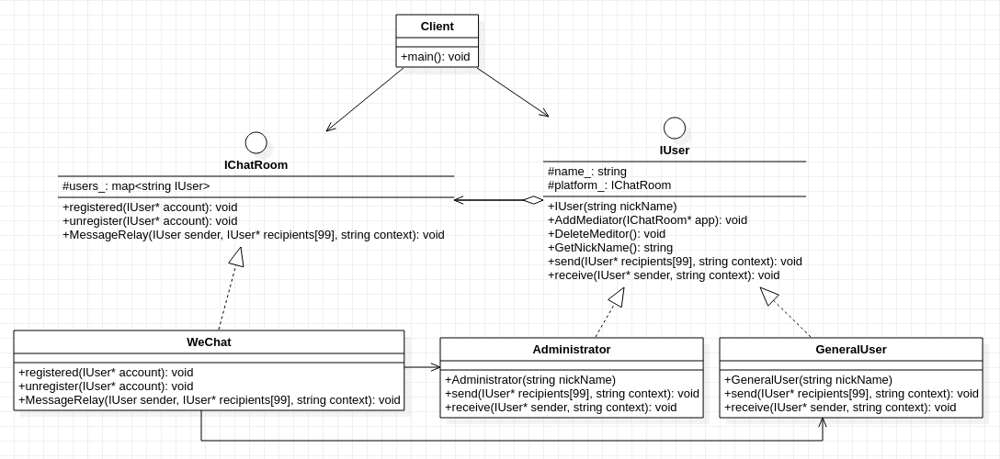

## **中介者模式**
    

    /**************************************************************************************************
    * 中介者(Mediator)模式又叫调停模式.直观体现迪米特法则(又名中间人法则)的核心思想
    * 核心思想:通过定义一个中介对象来封装一系列对象之间的交互,对象之间的交互通过中介者进行,
    *                  这样可以使得对象之间不需要彼此引用,实现对象之间松耦合的目的。
    * 
    * 包括四类对象:抽象中介者,具体中介者,抽象同事,具体同事类
    * 
    * 模式缺点:中介者模式是一种集中式的设计,由于中介者负责所有的对象的通信和交互,
    *                  对象数量的增加和不同类型对象的引入会使得中介者的职责越来越多,
    *                  程序的维护(修改)违背开放封闭原则,而中介者的角色设计也违背了单一职责原则
    *                  实际运行时,中介者承担着系统稳定的关键角色,也使系统变得脆弱
    * 
    * 个人想法:
    *          1,根据模式思想,可以扩展成一个抽象中介者对应多个抽象同事,实现不同类型对象之间的交互
    *              扩展后,包括四类对象:抽象中介者(1个), 具体中介者(1个), 抽象同事类(多个), 具体同事类(多个)
    *              个人认为,这样的设计才是真正符合中介者模式的实现思想
    *          2,在 MVC 模式中， 控制器(Controller)是中介者(Mediator)的同义词。
    *          3,中介者模式某程度上与订阅者模式很像，在实现需要明确自己的目的选择合适的模式
    *          4,分布式的设计：假设有一个程序，其所有的组件都变成了发布者，它们之间可以相互建立动态连接。 
    *              这样程序中就没有中心化的中介者对象， 而只有一些分布式的观察者。
    **************************************************************************************************/

```cpp
#include <map>
#include <string>
#include <boost/format.hpp>
using std::string;

class  IUser; //前向声明 即类声明
class IChatRoom
{
    protected:
        std::map<string, IUser*> users_;
    public:
        virtual void registered(IUser* account) = 0;
        virtual void unregister(IUser* account) = 0;
        virtual void MessageRelay(IUser* sender, IUser* (&recipients)[99], string context) = 0;
};
class  IUser
{
    protected:
        string name_;
        IChatRoom* platform_;
    public:
        IUser(string nickName): name_(nickName){
            //..............略
        }
        void AddMediator(IChatRoom* app){
            platform_ = app;
            platform_->registered(this);
        }
        void DeleteMeditor(){
            platform_->unregister(this);
        }
        string GetNickName(){
            return name_;
        }
        virtual void send(IUser* (&recipients)[99], string context) = 0;
        virtual void receive(IUser* sender, string context) = 0;
};
class WeChat: public IChatRoom
{
    public:
        virtual void registered(IUser* account){
            string nickName = account->GetNickName();
            if(users_.find(nickName) == users_.end()){
                users_.insert(std::pair<string, IUser*>(nickName, account));
            }
        }
        virtual void unregister(IUser* account){
            string nickName = account->GetNickName();
            if(users_.erase(nickName)){
                printf("%s已下线",nickName.c_str());
            }
            else{
                printf("%s根本不在线",nickName.c_str());
            }
        }
        virtual void MessageRelay(IUser* sender, IUser* (&recipients)[99], string context){
            static IUser* system = users_.find("系统后台")->second;
            for(IUser* otherSide : recipients){
                if(otherSide == nullptr) continue;
                string target = otherSide->GetNickName();
                otherSide->receive(sender, context);
                if(context == "我要哔...哔...哔...你\n" || context == "傻逼\n"){
                    string target = sender->GetNickName();
                    string context =  str(boost::format("%s 请注意你的言行\n") % target);
                    IUser* recipient[99] = {sender};
                    system->send(recipient, context);
                }
            }
        }
};
class GeneralUser: public IUser
{
    public:
        GeneralUser(string nickName): IUser(nickName){
            //...............略
        }
        virtual void send(IUser* (&recipients)[99], string context) {
            platform_->MessageRelay(this, recipients, context);
        }
        virtual void receive(IUser* sender, string context){
            string me = this->name_, he = sender->GetNickName();
            printf("%s收到了来自%s的消息: %s", me.c_str(), he.c_str(), context.c_str());
        }
};
class Administrator: public IUser
{
    public:
        Administrator(string nickName):IUser(nickName){
            //............略
        }
        virtual void send(IUser* (&recipients)[99], string context){
            recipients[0]->receive(this, context);
        }
        virtual void receive(IUser* sender, string context){
            //...............略
        }
};
int main(){ 
    IChatRoom* mediator = new WeChat(); 
    IUser* GM = new Administrator("系统后台");
    IUser* LiSi = new GeneralUser("李四");
    IUser* ZhangSan = new GeneralUser("张三");
    GM->AddMediator(mediator);
    LiSi->AddMediator(mediator);
    ZhangSan->AddMediator(mediator);
    IUser* lisi4zhangsan[99] = {ZhangSan};
    LiSi->send(lisi4zhangsan, "hello, 你好啊\n");
    IUser* zhangsan4lisi[99] = {LiSi};
    ZhangSan->send(zhangsan4lisi, "你是?\n");
    LiSi->send(lisi4zhangsan, "我要哔...哔...哔...你\n");
    ZhangSan->send(zhangsan4lisi, "傻逼\n");
}
```