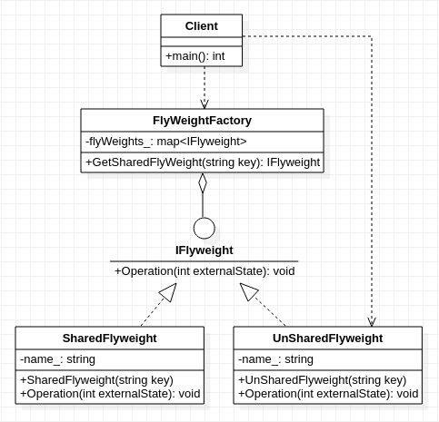

## **享元模式**
  

    /*************************************************************************************************
    * 核心思想:享元工厂+享元对象 
    *      宏观上，将具有相同特征属性的那一部分，抽象出来作为基础对象(模板对象)的公共属性，
    *      利用具有差异化的属性作为参数去实例化对象。例如：在已知一个微分方程f(x)的解形式的情况下，
    *      可以通过初始值x0去唯一确定f(x)的具体形式。解形式对应享元对象，初始值x0对应于实例化该享元
    *      对象所需要的输入参数
    * 该模式一般适用于(或者是要求)：类实现本身拥有大量共通属性且属性一致相同的数据成员 
    * 
    * 模式包括两类对象:享元工厂,享元对象(根据使用目的分为:共享与非共享)
    *      享元工厂:它负责享元对象的"生成,存放,管理".享元工厂是实现"共享"的关键,也是模式的重点
    *      享元对象(共享):继承自享元抽象类,由享元工厂负责生成,供所有用户使用
    *      享元对象(非共享):继承自享元抽象类,由用户/客户端自行生成,仅供创建它的用户/客户端使用
    * 
    * 模式包括两类状态:内部状态,外部状态,所有享元对象(共享/非共享)都有的
    *      内部状态:不随环境变化而变化的状态/数据,具备一定程度的稳定性,属于可复用的状态/数据
    *      外部对象:容易随环境改变而改变的状态/数据,不具备稳定性,属于不可复用的状态/数据
    * 
    * 关于内部状态与外部状态的理解:以围棋游戏举例说明
    *      享元工厂: 棋盒
    *      享元对象:棋子
    *      内部状态:棋子的颜色,只有黑色和白色,不会有其他颜色,具有稳定性,是可共享的状态/数据
    *      外部状态:棋子落子的位置,在棋盘栅格内位置可以任意,不具有稳定性,是不可共享的状态/数据
    **************************************************************************************************/
     
```cpp
#include <string>
#include <map>

class IFlyweight
{
    public:
        virtual void Operation(int externalState) = 0;
};

class UnSharedFlyweight:public IFlyweight //由创建它的用户自行生成,并管理
{
    private:
        std::string name_;
    public:
        UnSharedFlyweight(std::string key): name_(key){
            //................略
        }
        virtual void Operation(int externalState) {
            printf("this is UnSharedFlyweight  name is %s, externalState is %d\n",name_.c_str(), externalState);
        }
};

class SharedFlyweight:public IFlyweight //由享元工厂负责生成,存储,管理
{
    private:
        std::string name_;
    public:
        SharedFlyweight(std::string key): name_(key){
            //................略
        }
        virtual void Operation(int externalState) {
            printf("this is SharedFlyweight  name is %s, externalState is %d\n",name_.c_str(), externalState);
        }
};

class FlyweightFactory //仅存放共享的享元对象,也只生成共享的享元对象
{
    private:
        std::map<std::string, IFlyweight*> flyWeights_;
    public:
        IFlyweight* GetSharedFlyWeight(std::string key){
            if(flyWeights_[key] == nullptr){
                flyWeights_[key] = new SharedFlyweight(key);
            }
            return (IFlyweight*)flyWeights_[key];
        }
};

int main(){
    FlyweightFactory* factory = new FlyweightFactory();
    IFlyweight* lxq = factory->GetSharedFlyWeight("lixianqiang"); // 共享的享元对象有享元工厂创建
    IFlyweight* me = factory->GetSharedFlyWeight("lixianqiang");
    lxq->Operation(11);
    IFlyweight* other = new UnSharedFlyweight("wawa"); //非共享的享元对象客户端自行创建
    other->Operation(12);
}
```