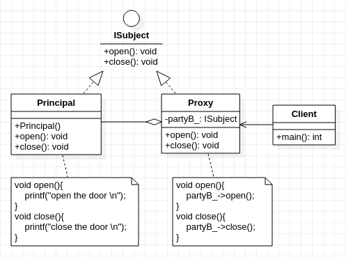

## **代理模式**
  

	/*************************************************************************************************
	* 	代理人与委托人具有一模一样的行为(函数),只不过是代理人执行具体行为(具体函数)时,调用了委托人的函数
	* 	其实就是套娃行为,代理人就行手套,委托者就像手,表面是手套在干活,实际是手在干活,代理人充当皮套角色,
	* 	因此可以继承同一个抽象类
	* 	优点:
	* 		客户端使用代理对象实现对目标对象的访问,这种间接访问的方式更好地隐藏目标对象.
	* 		同时通过代理对象能更好地控制目标对象的访问行为
	*************************************************************************************************/
	 
```cpp
#include<stdio.h>

class ISubject 
{
	public:
		virtual void open() = 0;
		virtual void close() = 0;
};

class Prinicipal :public ISubject
{
	public:
		Prinicipal(){
			//...................略
		}
		virtual void open(){
			printf("open the door\n");
		}
		virtual void close(){
			printf("close the door\n");
		}
};

class Proxy :public ISubject
{
	private:
		ISubject* partyB_;
	public:
		Proxy(int taskID){
			partyB_ = new Prinicipal();
		}
		virtual void open(){
			printf("I am Proxy ");
			partyB_->open();
		}
		virtual void close(){
			printf("I am Proxy ");
			partyB_->close();
		}
};

int main()
{
	ISubject* agent = new Proxy(2020);
	agent->open();
	agent->close();
}
```