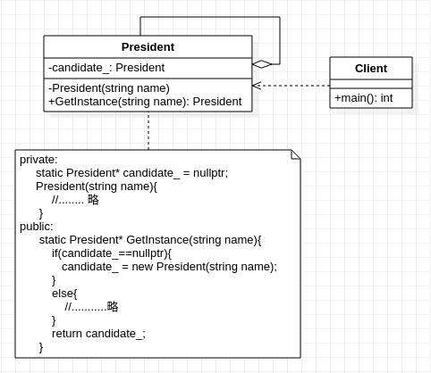

## **单例模式**

  

    /************************************************************************************  
     * 要求对象只能创建一次,只有一个实例对象,即唯一的内存地址;
     * 但指向该地址的指针对象(引用对象)可以有多个
     * 该模式返回的是实例对象的指针(引用); 
     * 单例模式有两种实现:饿汉式和懒汉式
     * 饿汉式:类一旦加载就创建一个单例(就是说程序运行之初实例就已经初始化好了)
     * 懒汉式:类加载时没有生成单例，只有当第一次调用才去创建这个单例,但需要注意线程安全  
     * 使用注意事项：在类的设计上，"对于类的对象生成是否应该唯一"的问题上，如果唯一确定
     * 或保证的话，可以通过工厂模式来控制类对象的单例生成，即单例工厂模式，比起直接在
     * 类上使用单例模式更合适。当然如果问题是确定的话则除外
    *************************************************************************************/

```cpp
#include <string>
using std::string;

class President
{
    private:
        static President* candidate_;
    private:
        President(string name){
                printf("new president takes office, whose name is %s\n", name.c_str());
        }
        President(const President& cpObj) = delete; // 使用单例模式时最好禁用复制构造函数
    public:
        static President* GetInstance(string name)
        {
            if(President::candidate_ == nullptr){
                President::candidate_ = new President(name);
            }
            else{
                printf("Sorry, %s could not be elected as president before the end of Term\n", name.c_str());
            }
            return candidate_;
        }
};
President* President::candidate_ = nullptr;

int main(){
    President* he =  President::GetInstance("trump");
    President* me =  President::GetInstance("lxq");
}
```
