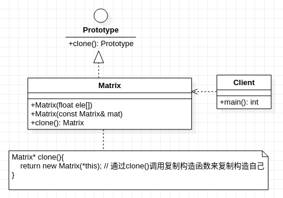

## **原型模式**
     

    /***********************************************************************************
     * 原型模式对C++来说实际就是通过 clone() 函数实现复制拷贝函数,
     * 即通过函数clone()去调用复制构造函数,而且关键在于复制构造的对象还是自己本身
     * 关于复制构造涉及到深复制与浅复制,个人理解是:
     * 浅复制,改变对象A的数据会引起对象B的数据改变,因为复制的是引用
     * 反之,深复制,改变对象A的数据不会影响对象B的数据;因为复制的是数据本身 
    ************************************************************************************/
    
```cpp
#include <stdio.h>

class Prototype //实际操作中该抽象类可以不用
{
    public:
        virtual Prototype* clone()=0;
};

class Matrix:public Prototype
{
    public:
        float* eles;
    public:   
        Matrix(float ele[]): eles(ele){
            //....................略
        }
        Matrix(const Matrix& mat){
           eles = mat.eles;  //浅复制,单步调试下,可以发现数据内存地址都是一样
        }
        virtual Matrix* clone(){
            return new Matrix(*this); // 通过clone()调用复制构造函数来复制构造自己
        }
};

int main(){
    float ele[] = {1,23,4};
    Matrix* matA = new Matrix(ele);
    Matrix* matB = matA->clone();
    if(matB== matA){
        printf("it's different between matB and matA due to  owns completely different memory address \n");
    }
    else{
        printf("both matB and matA are the same object\n");
    }
}
```