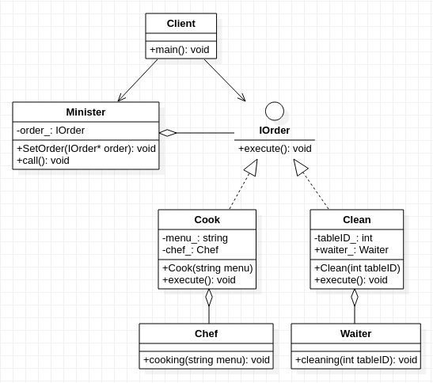

## **命令模式**
   

    /**************************************************************************************************
    * 命令（Command）模式的定义如下：将一个请求(命令/行为)封装为一个对象，
    * 将请求(命令/行为)的调用和执行进行分离,二者通过请求(命令/行为)进行连接
    * 这样方便将命令对象进行储存、传递、调用、增加与管理。
    * 
    * 该模式完美匹配饭店服务的工作流程: 客人点完菜,部长minister下达做菜的命令SetOrder()
    * 然后大吼一声call():"干活啦",厨房里的厨师chef收到命令开始做菜cooking().
    * 客人用餐完毕,需要收拾餐桌.部长minister根据桌号下达了清洁的命令SetOrder()
    * 又大吼一声call():"干活啦",其他的服务员waiter收到命令开始收拾cleaning().
    * 
    * 首先,实现了命令的调用与执行相互分离.其次,负责命令具体实现的人各不相同,因为每个人的职责不一样
    * 部长作为命令具体调用者,负责对请求(做菜,收拾)发起调用
    * 厨师作为命令具体执行者,负责对请求(做菜)的具体实现
    * 服务员作为命令具体执行者,负责对请求(收拾餐桌)的具体实现
    ***************************************************************************************************/
     
```cpp
#include<stdio.h>
#include <string>

class IOrder
{
    public:
        virtual void execute() = 0;
};

class Minister
{
    private:
        IOrder* order_;
    public:
        void SetOrder(IOrder* order){
            order_ = order;
        }
        void call(){
            order_->execute();
        }    
};

class Chef
{
    public:
        void cooking(std::string menu){
            printf("cooking %s\n", menu.c_str());
        }
};

class Cook:public IOrder
{
    private:
        std::string menu_;
        Chef* chef_;
    public:
        Cook(std::string menu): menu_(menu), chef_(new Chef()){
            //................略
        }
        virtual void execute(){
            chef_->cooking(menu_);
        }
};

class Waiter
{
    public:
        void cleaning(int tableID){
            printf("Tidy the table no.%d\n",tableID);
        }
};

class Clean:public IOrder
{
    private:
        int tableID_;
        Waiter* waiter_;
    public:
        Clean(int tableID): tableID_(tableID), waiter_(new Waiter()){
            //................略
        }
        virtual void execute(){
            waiter_->cleaning(tableID_);
        }
};

int main(){
    Minister* minister = new Minister();
    minister->SetOrder(new Cook("鱼香肉丝"));
    minister->call();
    minister->SetOrder(new Clean(007));
    minister->call();
}
```