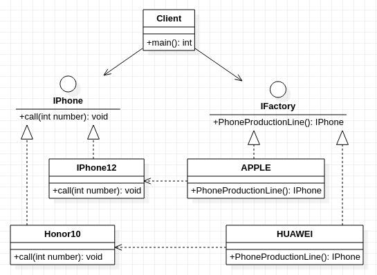

## **工厂方法模式**
     

    /********************************************* 
    * 重点在于把创建对象的能力放到工厂中实现 
    * 工厂模式，别名：虚拟构造器/多态工厂模式
    **********************************************/
    
```cpp
#include<string>
using std::string;

class IPhone
{
    public:
        virtual void call(int number)=0;
};

class IFactory
{
    public:
        virtual IPhone* PhoneProductionLine()=0;
};

class Honor10: public IPhone
{
    public:
        virtual void call(int number){
            printf("Calling number %d with Honor10",number);
        }
};

class IPhone12: public IPhone
{
    public:
        virtual void call(int number){
            printf("Calling number %d with FaceTime",number);
        }
};

class  HUAWEI: public IFactory
{
    public:
        IPhone* PhoneProductionLine(){
            printf("Mobile phone Honor10 assembly completed");
            return new Honor10();
        };
};

class  APPLE: public IFactory
{
    public:
        IPhone* PhoneProductionLine(){
            printf("Mobile phone IPhone12 assembly completed");
            return new IPhone12();
        }
};

int main()
{
    IFactory* huawei = new HUAWEI();
    IPhone* honor10 = huawei->PhoneProductionLine();
    honor10->call(110);
}
```