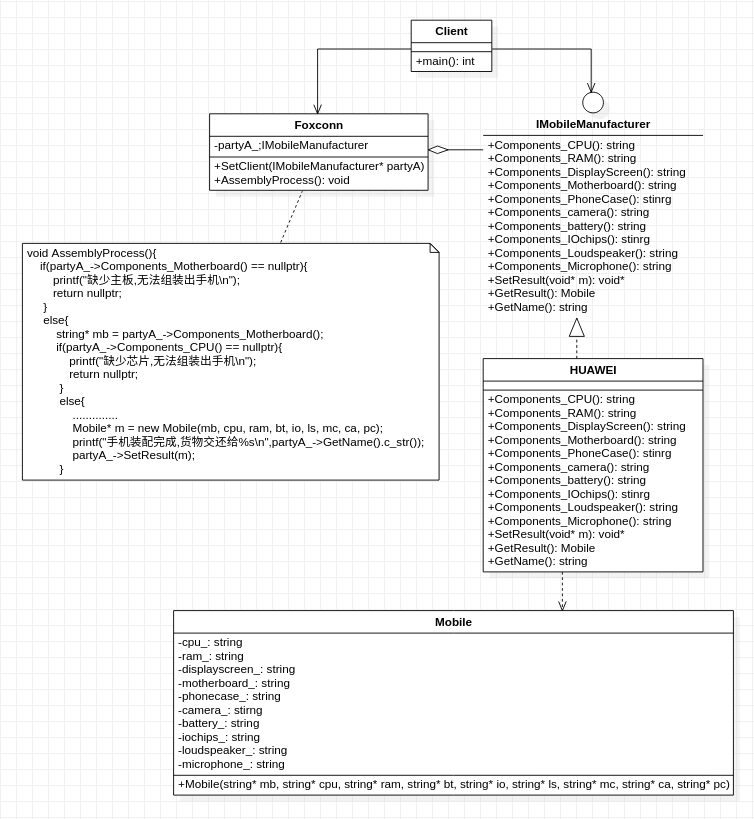

## **建造者模式**
   

        /***********************************************************************************************************
        * 建造者模式又名生成器模式
        * 通俗理解： 该模式把类的构造函数交给另一个对象(建造者)去做
        * 模式动机:
        *      在软件开发中,经常存在一些类似手机的复杂对象,它们拥有一系列成员属性
        *      在这些复杂对象中,成员属性之间甚至还可能存在一些限制条件
        *      有些属性的赋值必须按照某个顺序,属性A没有赋值之前,属性B可能无法赋值
        *      复杂对象相当于一台待装配的手机，而复杂对象的成员属性相当于手机的零部件，
        *      复杂对象的建造过程就相当于手机的组装过程
        * 复杂对象的理解：
        *      满足以下条件之一：构造参数多，参数可选，构造过程有顺序要求
        *      注意：不同类型对象不能作为复杂对象的依据，也不是建造者模式所关心的。因为它们本质是同源的（都继承了抽象基类）
        * 建造者模式的主要包含以下几类角色:
        *      指挥者,抽象建造者,具体建造者.它们之间的关系就像代工企业与手机企业的关系
        * 指挥者:负责控制复杂对象的组装过程,就像手机装配流程,是有严格顺序要求的,顺序错了会装不上.
        *      该角色就像代工企业,如:富士康,比亚迪,专门给华为进行手机装配,但自身不涉及零部件生产
        * 抽象建造者:负责为复杂对象生成所必须的各个部件提供一系列抽象接口.
        *      该角色就像手机制造商,他们知道一台手机的生产需要主板,电池,cpu,显示屏等必要的零部件才能完成
        * 具体建造者:抽象建造者相关接口的具体实现, 就像华为为他们自家手机提供所需要的零部件,然后交给富士康代工
        * 该模式强调产品对象的构建过程(顺序),因此适用场景如下:
        *      需要生成的产品对象有复杂的内部结构,这些产品对象通常包含多个成员属性
        *      需要生成的产品对象的属性相互依赖,需要指定其生成顺序
        * 如何理解"建造者模式将复杂对象的构建与它的表示分离,使得同样的构建过程可以创建不同的表示"
        *      正如手机(复杂对象)的装配(构建过程)由代工企业(指挥者)负责,华为(建造者)不需要参与就能直接获得手机(复杂对象)
        *      所有手机的组装流程(构建过程)是相同的,但根据各零部件的选择(如:芯片可以选择高通/海思)
        *      可以组装出不同配置的手机(成员属性不同的复杂对象),如高配版,低配版的华为P40, 华为P40pro等等
        * 需要强调的是,指挥者虽然参与复杂对象的建造流程.但是复杂对象的生成实在具体建造者中进行,
        *      正如富士康给华为代工手机装配,但买家(客户端)实际上是从旗舰店(华为)那里购买手机(复杂对象),而不是富士康
        * 另外，对于建造者模式来说，指挥者不是必须的，只有被构建对象需要构建步骤时才需要考虑，毕竟建造者才是产生对象的地方
        *************************************************************************************************************/
         
```cpp
#include <string>
using std::string; 

//产品 手机 具有一系列复杂的成员属性以及复杂的初始化过程
class Mobile
{
        private:
                string* cpu_;
                string* ram_;
                string* displayscreen_;
                string* motherboard_;
                string* phonecase_;
                string* camera_;
                string* battery_;
                string* iochips_;
                string* loudspeaker_;
                string* microphone_;
        public:
                Mobile(string* mb, string* cpu, string* ram, string* bt, string* io, string* ls, string* mc, string* ca, string* pc):
                        motherboard_ (mb), cpu_(cpu), ram_(ram), battery_(bt), iochips_(io), loudspeaker_(ls), microphone_(mc),
                        camera_(ca),  phonecase_(pc){
                                //....................略
                }
};

//抽象建造者 手机制造商 提供手机装配所需的必要零部件的抽象接口
class IMobileManufacturer
{
        public:
                virtual string* Components_CPU() = 0;
                virtual string* Components_RAM() = 0;
                virtual string* Components_DisplayScreen() = 0;
                virtual string* Components_Motherboard() = 0; 
                virtual string* Components_PhoneCase() = 0;
                virtual string* Components_camera() = 0;
                virtual string* Components_battery() = 0;
                virtual string* Components_IOchips() = 0;
                virtual string* Components_Loudspeaker() = 0;
                virtual string* Components_Microphone() = 0;
                virtual void SetResult(void* m) = 0;
                virtual Mobile* GetResult() = 0;
        public:
                virtual string GetName() = 0;
};

//具体建造者 华为 提供手机装配所需的必要零部件的具体接口
class HUAWEI:public IMobileManufacturer
{
        private:
                Mobile* mobile_;
        public: 
                virtual string* Components_CPU(){ return new string("Hisilicon");}
                virtual string* Components_RAM(){ return new string("Micron");}
                virtual string* Components_DisplayScreen(){ return new string("BOE");}
                virtual string* Components_Motherboard(){ return new string("ASUS");}
                virtual string* Components_PhoneCase(){ return new string("other");}
                virtual string* Components_camera(){ return new string("Leica");}
                virtual string* Components_battery(){ return new string(" Samsung");}
                virtual string* Components_IOchips(){ return new string("Hisilicon");}
                virtual string* Components_Loudspeaker(){ return new string(" Sony");}
                virtual string* Components_Microphone(){ return new string("Takstar");}
                virtual void SetResult(void* m){mobile_ = (Mobile*)m;}
                virtual Mobile* GetResult(){return mobile_;}
        public:
                virtual string GetName() {return "HUAWEI";}
};

//指挥者 代工厂 负责装配手机完整流程
class  Foxconn
{
        private:
                IMobileManufacturer* partyA_;
        public:
                void SetClient(IMobileManufacturer* pA){
                        partyA_ = pA;
                }
                bool AssemblyProcess()
                {
                        if(partyA_->Components_Motherboard() == nullptr)
                        {
                                printf("缺少主板,无法组装出手机\n");
                                return false;
                        }
                        else
                        {
                                string* mb = partyA_->Components_Motherboard();
                                if(partyA_->Components_CPU() == nullptr)
                                {
                                        printf("缺少芯片,无法组装出手机\n");
                                        return false;
                                }
                                else
                                {
                                        string* cpu = partyA_->Components_CPU();
                                        if(partyA_->Components_RAM() == nullptr)
                                        {
                                                printf("缺少内存,无法组装出手机\n");
                                                return false;    
                                        }
                                        else
                                        {
                                                string* ram = partyA_->Components_RAM();                                
                                                if(partyA_->Components_battery() == nullptr)
                                                {
                                                        printf("缺少电池,无法组装出手机\n");
                                                        return false;    
                                                }
                                                else
                                                {
                                                        string* bt = partyA_->Components_battery();                                
                                                        if(partyA_->Components_IOchips() == nullptr)
                                                        {
                                                                printf("缺少IO芯片,无法组装出手机\n");
                                                                return false;    
                                                        }
                                                        else
                                                        {
                                                                string* io = partyA_->Components_IOchips();                                
                                                                if(partyA_->Components_Loudspeaker() == nullptr)
                                                                {
                                                                        printf("缺少喇叭,无法组装出手机\n");
                                                                        return false;    
                                                                }
                                                                else
                                                                {
                                                                        string* ls = partyA_->Components_Loudspeaker();                                
                                                                        if(partyA_->Components_Microphone() == nullptr)
                                                                        {
                                                                                printf("缺少麦克风,无法组装出手机\n");
                                                                                return false;    
                                                                        }
                                                                        else
                                                                        {
                                                                                string* mc = partyA_->Components_Microphone();                                
                                                                                if(partyA_->Components_camera() == nullptr)
                                                                                {
                                                                                        printf("缺少摄像头,无法组装出手机\n");
                                                                                        return false;    
                                                                                }
                                                                                else
                                                                                {
                                                                                        string* ca = partyA_->Components_camera();                                
                                                                                        if(partyA_->Components_PhoneCase() == nullptr)
                                                                                        {
                                                                                                printf("缺少外壳,无法组装出手机\n");
                                                                                                return false;    
                                                                                        }
                                                                                        else
                                                                                        {
                                                                                                string* pc = partyA_->Components_PhoneCase();
                                                                                                Mobile* m = new Mobile(mb, cpu, ram, bt, io, ls, mc, ca, pc);
                                                                                                printf("手机装配完成,货物交还给%s\n",partyA_->GetName().c_str());
                                                                                                partyA_->SetResult(m);
                                                                                                return true;
                                                                                        }
                                                                                }
                                                                        }
                                                                }
                                                        }                                        
                                                }
                                        }
                                }
                        }
                }
};

int main()
{
        Foxconn* foxconn = new Foxconn();
        IMobileManufacturer* huawei = new HUAWEI();
        foxconn->SetClient(huawei);
        if(foxconn->AssemblyProcess()){
                Mobile* mobile = huawei->GetResult();
        }
}
```
