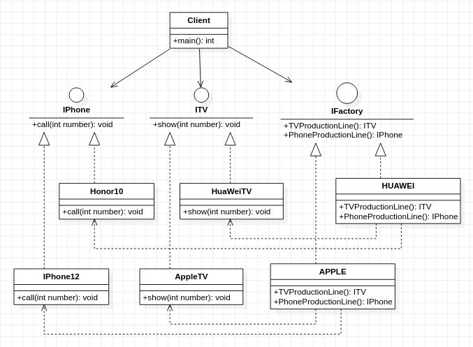

## **抽象工厂模式**
     

    /*********************************************************************************
     * 与工厂方法类似,只是设计上更符合工厂的概念
     * 一个工厂应该拥有多个产品族,如:苹果的手机,电脑,耳机等。
     **********************************************************************************/

```cpp
#include<string>
using std::string;

class IPhone
{
    public:
        virtual void call(int number)=0;
};

class ITV
{
    public:
        virtual void show(int number)=0;
};

class IFactory
{
    public:
        virtual IPhone* PhoneProductionLine()=0;
        virtual ITV* TVProductionLine()=0;
};

class XiaoMi10:public IPhone
{
    public:
        virtual void call(int number){
            printf("Calling number %d with XiaoMi10\n",number);
        }
};

class XiaoMiTV:public ITV
{
    public:
        virtual void show(int num){
            printf("switch No. %d program with XiaoMiTV\n",num);
        }
};

class XIAOMI:public IFactory
{
    public:
        virtual XiaoMi10* PhoneProductionLine(){
            printf("Mobile phone XiaoMi10 assembly completed\n");
            return new XiaoMi10();
        }
        virtual XiaoMiTV* TVProductionLine(){
            printf("TV kc5286 assembly completed\n");
            return new XiaoMiTV();
        }
};

class IPhone12:public IPhone
{
    public:
        virtual void call(int number){
            printf("Calling number %d with FaceTime\n",number);
        }
};

class AppleTV:public ITV
{
    public:
        virtual void show(int num){
            printf("switch No. %d program with AppleTV\n",num);
        }
};

class APPLE:public IFactory
{
    public:
        virtual IPhone12* PhoneProductionLine(){
            printf("Mobile phone IPhone12 assembly completed\n");
            return new IPhone12();
        }
        virtual AppleTV* TVProductionLine(){
            printf("AppleTV assembly completed\n");
            return new AppleTV();
        }
};

int main()
{
    IFactory* apple = new APPLE();
    IPhone* iphone12 = apple->PhoneProductionLine();
    ITV* appletv = apple->TVProductionLine();
    appletv->show(1);
    iphone12->call(110);
}
```