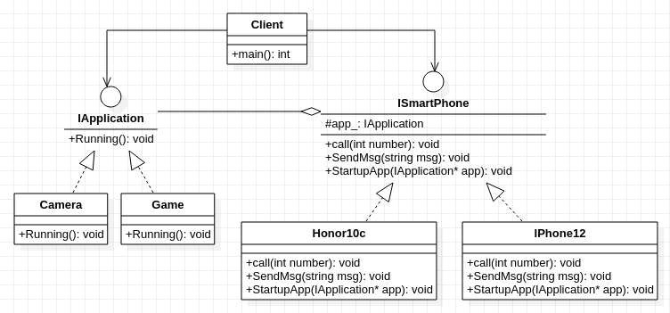

## **桥接模式**
     

    /***********************************************************************************************************
    * 核心思想: 在抽象层面上的实现类的组合
    * 
    * 设计初衷:当类的职责存在多个变化方向时,根据单一职责原则,应该将其分离.但是职责的分离会破环类的完整性
    *                  通过类的组合,让每一个类单独控制一类职责,在保证不失类的完整性,最大限度地实现职责分离
    * 
    * 关于职责变化的理解:
    *      按照单一职责原则,一个类应该只负责一类职责(功能).但在实际的设计中,对于一个类,其职责(功能)划分是存在一定难度。
    *      因为职责的划分界定没有明确的统一标准.它们之间的关系也不像代数方程,有明确的数学关系.
    *      就像智能手机那样,可以按照操作系统、功能、尺寸、品牌等方式划分，这些划分往往代表(暗示)着一类职责(功能)
    *      其次,职责(功能)是动态发展,即使保证了设计初期在大体变化方向上是一致,但在不断扩展过程中,也会为当前类引入新的职责(功能),
    *      就像手机演变过程,充分体现了不断扩展变化中引入新的职责(功能).从打电话(发短信)->上网/拍照/打游戏->.....未来的功能
    * 
    * 常规解决办法:多继承,类的组合
    * 多重继承的方式
    *      缺点:增加父类与子类之间的耦合度,修改父类的同时,为了适应父类变化.子类必须同步修改, 违背开放封闭原则 
    * 类的组合  
    *      优点: 解决了多重继承带来的耦合问题.这种使用组合代替继承的做法,体现了合成复用原则
    *                 通过类的组合,把职责(功能)封装在类中,让每一个类去独立变化各自的职责,体现了单一职责原则
    * 
    * 适用场景:1,一个类在职责划分时,存在多种可能性时
    *                      2,现有的类在不断扩展变化中引入了新的职责时 
        ***********************************************************************************************************/
     
```cpp
#include<string>
using std::string;

/***********************************************************************************************************************
 * 对智能手机来说，从分类角度可以这样分：基本功能(打电话/发短信)，软件应用(上网/拍照/打游戏)
 * 将基本功能(打电话发短信)作为主要的职责(功能)变化的方向符合手机本身的意义。对于软件功能，可以通过其抽象对象进行组合
************************************************************************************************************************/
class IApplication
{
    public:
        virtual void Running() = 0;
};

class ISmartPhone
{ 
    protected:
        IApplication* app_;
    public:
        virtual void call(int number) = 0;
        virtual void SendMsg(string msg) = 0;
        virtual void StartupApp(IApplication* app) = 0;
};

class Camera :public IApplication 
{
    public:
        virtual void Running() {
            printf("take a photo\n");
        }
};

class Game :public IApplication 
{
    public:
        virtual void Running() {
            printf("launch a game\n");
        }
};

class IPhone12 :public ISmartPhone
{
    public:
        virtual void call(int number) {
            printf("Calling number %d with FaceTime\n", number);
        }
        virtual void SendMsg(string msg) {
            printf("Send a message taht context is %s with FaceTime\n",msg.c_str());
        }

        virtual void StartupApp(IApplication* app) {
            printf("the app run on the IOS platform\n");
            app_ = app;
            app_->Running();
        }
};

class Honor10c :public ISmartPhone
{
    public:
        virtual void call(int number) {
            printf("Calling number %d with WeChat\n", number);
        }

        virtual void SendMsg(string msg) {
            printf("Send a message taht context is %s with WeChat \n",msg.c_str());
        }

        virtual void StartupApp(IApplication* app) {
            printf("the app run on the Android platform\n");
            app_ = app;
            app_->Running();
        }
};

int main(){
    ISmartPhone* mobilephone = new IPhone12();
    IApplication* LoL = new Game();
    mobilephone->StartupApp(LoL);
}
```