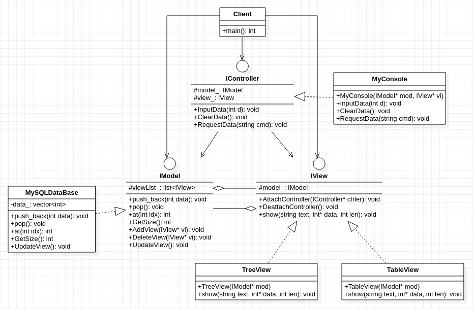

## **模型视图控制器模式**
     

/**************************************************************************************
 * 模式-视图-控制器(Model-View-Model)模式简称MVC模式,
 * 需要注意的是:
 *      该模式在思想上能简单理解为是观察者模式的一种扩展,但它实际是一种软件架构模式
 *      而并非设计模式,这里仅仅是根据其模式思想在设计模式上进行简单实现
 * 
 * 模型:负责数据的存储与管理 
 * 视图:负责数据的可视化 
 * 控制器:负责处理用户的行为(数据编辑/输入)和并反馈给模型(Model)
 *          
 * 主题(Subject )= 模型(Model)
 * 观察者(Observer) = 视图(View)
 * 控制器(Controller)实质就是中介者模式里的中介者对象
 * 
 * 个人看法:
 *          python使用引用传递在一定程度上就已经能够实现数据的实时同步更新,因此
 *          参考这一做法,在形参上使用引用再结合该模式应该可以降低模式实现难度
 * 参考资料: <https://blog.csdn.net/zhangli_/article/details/50419783>
****************************************************************************************/

```cpp
#include <vector>
#include <list>
#include <iostream>

class IView; //前向引用声明, 出现相互依赖时使用,简单理解就是类的声明

class IModel 
{
    protected:
        std::list<IView*> viewList_;
    public:
        void AddView(IView* vi){
            viewList_.push_back(vi);
        }
        void DeleteView(IView* vi){
            viewList_.remove(vi);
        }
        virtual void UpdateView() = 0; 
        virtual void push_back(int data) = 0;
        virtual void pop() = 0;
        virtual int at(int idx) = 0;
        virtual int GetSize() = 0;        
};

class IView  
{
    protected:
        IModel* model_;
    public:
        void AttachModel(IModel* mod){
                model_ = mod;
                model_->AddView(this);
        }
        void DeattachModel(){
            if(model_ != nullptr){
                model_->DeleteView(this);
                model_ = nullptr;
            }
        }
        virtual void show(std::string text, int data[], int len) = 0;               
};

class IController  
{
    protected:
        IModel* model_;
        IView* view_;
    public:
        virtual void InputData(int d) = 0;
        virtual void ClearData() = 0;
        virtual void RequestData(std::string cmd) = 0;
};

class MySQLDataBase: public IModel
{
    private:
        std::vector<int> data_; 
    public:
        virtual void UpdateView(){
            for (auto vi = viewList_.begin();vi != viewList_.end() ;++vi){
                int len = data_.size(), tmp[len];
                for(int i = 0; i != len; ++i){
                    *(tmp + i) = data_[i];
                }
                (*vi)->show("模型发生变化", tmp, len); 
            }
        }
        virtual void push_back(int data){
            data_.push_back(data);
        }
        virtual void pop(){
            data_.pop_back();
        }
        virtual int at(int idx){
            return data_[idx];
        }
        virtual int GetSize(){
            return data_.size();
        }   
};

class TableView: public IView
{
    public:
        TableView(IModel* mod=nullptr){
            if(mod != nullptr){
                model_->AddView(this);
            }
        }
        virtual void show(std::string text, int data[], int len){
            std::cout << text <<"   " << "表格形式显示" << "      " ;
            for(int i = 0; i != len; ++i){
                std::cout << *(data+i) << " ";
            }
            std::cout << std::endl;
        }
};

class TreeView: public IView
{
    public:
        TreeView(IModel* mod=nullptr){
            if(mod != nullptr){
                model_->AddView(this);
            }
        }
        virtual void show(std::string text, int data[], int len){
            std::cout << text << "   " << "树状图形式显示" << "  " ;
            for(int i = 0; i != len; ++i){
                std::cout << *(data+i) << " ";
            }
            std::cout << std::endl;
        }
};

class MyConsole: public IController
{
    public:
        MyConsole(IModel* mod, IView* vi=nullptr){
            model_ = mod;
            view_ = vi;
        }
        virtual void InputData(int d){
            model_->push_back(d);
            model_->UpdateView();
        }
        virtual void ClearData(){
            model_->pop();
            model_->UpdateView();
        }
        virtual void RequestData(std::string cmd){
            if(cmd == "用户请求显示数据个数"){
                int data[1] = {model_->GetSize()};
                view_->show(cmd, data, 1);
            }
            else if(cmd == "用户请求显示所有数据"){
                int len = model_->GetSize(), data[len];
                for(int i=0; i != len; ++i){
                    *(data + i) = model_->at(i);
                }
                view_->show(cmd, data, len);
            }
        }
};

int main()
{
    IModel* model = new MySQLDataBase();
    IView* tree = new TreeView();
    IView* table = new TableView();
    tree->AttachModel(model);
    table->AttachModel(model);
    IController* ctrler1 = new MyConsole(model, tree);
    IController* ctrler2 = new MyConsole(model, table);
    ctrler1->InputData(1);
    ctrler2->InputData(23);
    ctrler2->InputData(32);
    ctrler2->InputData(67);
    ctrler1->ClearData();
    ctrler1->RequestData("用户请求显示数据个数");
    ctrler2->RequestData("用户请求显示所有数据");
}
```