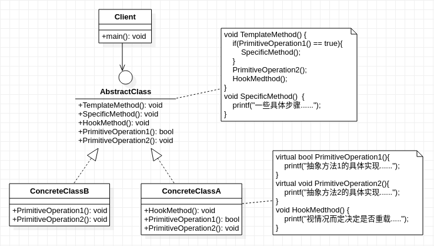

## **模板方法模式**
 

    /************************************************************************************************************************
    * 当系统或算法有一个固定的步骤(流程),可以使用模板方法,该模式对大规模的系统工程比较有效,
    * 对小型系统或算法应用实际意义不大,因为规模较小的系统或某单一算法所涉及的步骤(流程)并不大,在设计意义上不占优势
    * 流程(步骤)是指:接口层面(函数级别),而不是其内部的流程(步骤).
    * 
    * 个人看法:不需要拘泥于模板方法的设计形式,更应该着重于它给人所带来的启示(或者说设计目的,设计思想):
    *                    它将不变的行为在父类实现,去除子类在这一部分的重复行为.
    *                    即:把子类中重复的部分提升到父类(抽象类),子类(具体类)负责实现变化点
    * 
    * 设计技巧:使用钩子方法(hook),即:为父类(抽象类)提供一个函数的空实现(即函数内容为空)，由子类进行选择性重写的方法。
    *                    钩子方法可以结合函数句柄来做，通过钩子方法返回一个函数句柄。
    ************************************************************************************************************************/
     
```cpp
#include<stdio.h>

class AbstractClass
{
    public:
        void TemplateMethod() { // 模板方法的组成:逻辑判断+抽象方法+具体方法(钩子方法).
            if(PrimitiveOperation1() == true){  //逻辑判断
                SpecificMethod();                          //具体方法
            }
            PrimitiveOperation2();                       //抽象方法
            HookMedthod();                                   //钩子方法
        }
        void SpecificMethod()  {    //具体方法,系统/算法的公共部分
            printf("一些具体步骤......");
        }
        void HookMedthod() {}       //钩子方法(函数的空实现),让子类根据自身情况决定是否重载
        virtual bool PrimitiveOperation1() = 0;
        virtual void PrimitiveOperation2() = 0; 
};

class ConcreteClassA:public AbstractClass
{
    public:
        virtual bool PrimitiveOperation1(){
            printf("抽象方法1的具体实现......");
        }
        virtual void PrimitiveOperation2(){
            printf("抽象方法2的具体实现......");
        }
        void HookMedthod() {
            printf("视情况而定决定是否重载.....");
        }
};

class ConcreteClassB:public AbstractClass
{
    public:
        virtual bool PrimitiveOperation1(){
            //...........略
        }
        virtual void PrimitiveOperation2(){
            //............略
        }
        //不重载实现钩子方法
};

int main(){
    AbstractClass* methodA = new ConcreteClassA();
    methodA->TemplateMethod();
}
```