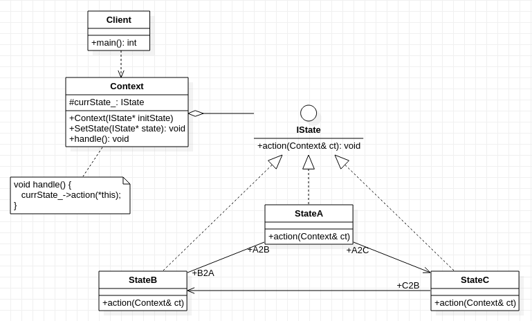

## **状态模式**
     

	/******************************************************************************************************
	* 核心思想:将原本状态之间的复杂关系(即使是不相关的状态也放到一起判断,使设计变得紧耦合),
	* 					  转变成简单关系(判断条件仅包含与之相关的状态,并将它们封装在一起)
	* 
	* 状态模式包括两类对象：一个上下文对象，若干个状态对象
	* 状态对象负责管理两样东西：负责当前状态所对应的具体行为; 切换到下一个相关状态的逻辑条件判断
	* 
	* 传统办法：把所有可能发生的状态通过条件判断集中在一起中，相应行为则存放在条件语句之中。
	* 						 这种把所有状态集中管理的做法，无形中就是把所有（无关）状态绑定在一起
	* 						通过增加判断语句进行扩展虽然不影响状态判断与切换，但是对于状态之间的关系却显示异常紧密,
	* 						因为即使其他状态与它无关也被迫放在一起,这种做法不符合开放封闭原则
	*********************************************************************************************************/

```cpp
#include <random>

class Context; //前向引用声明, 当类与类之间出现相互依赖时使用,简单理解就是类的声明

class IState 
{
	public:
		virtual void action(Context& ct) = 0;
};

class Context
{
	protected:
		IState* currState_;
	public:
		Context(IState* initState): currState_(initState) {
			//...................略
		}

		void SetState(IState* st) { 
			currState_ = st; 
		}

		void handle() { 
			currState_->action(*this); 
		}
};

class StateA :public IState
{
	public:
		virtual void action(Context& ct);
};

class StateB :public IState
{
	public:
		virtual void action(Context& ct);
};

class StateC :public IState
{
	public:
		virtual void action(Context& ct);
};

void StateA::action(Context& ct) {
	bool res = 0 + (rand() % (1 - 0 + 1)) == 1; //通过随机数模式执行成功和失败时需要执行不同的状态
	if (res == true) { //状态切换的条件判断仅包含与之相关的状态,不包含其他无关状态
		printf(" A to B\n");
		ct.SetState(new StateB()); 
	}
	else {
		printf(" A to C\n");
		ct.SetState(new StateC()); 
	}
};

void StateB::action(Context& ct) {
	printf(" B to A\n");
	ct.SetState(new StateA()); 
};

void StateC::action(Context& ct) {
	printf(" C to B\n");
	ct.SetState(new StateB()); 
};

int main() {
	Context* context = new Context(new StateA());
	context->handle();
	context->handle();
}
```