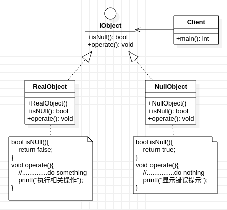

## **空对象模式**
     

    /***************************************************************************************************************************
    * 空对象模式(Null Object Pattern)
    * 模式动机:
    *          客户端在调用函数时,由于使用不当,为函数传入非法参数,使得函数执行返回Null指针,而不是函数所声明的返回类型对象             
    *          使得当前对象无法继续执行原本返回类型对象的功能. 意味着函数的调用端(客户端/用户)需要为返回值做Null指针判断,
    *          这么做会导致非常多的冗余的检查代码.并且如果某一个调用端忘记做返回值类型的检查,而直接使用返回的对象,
    *          那么就有可能抛出空指针异常从而导致程序出错.这时,如果返回的是不执行任何动作(或仅带有错误提示信息)的空对象.
    *          能大大减少了调用端(客户端)对当前对象判断检查工作,同时这样的空对象也可以在数据不可用的时候提供默认的行为.
    *
    * 模式扩展:
    *          1, 空对象模式可以结合工厂模式,使用简单工厂视条件/情况去生成可用对象(RealObject)或空对象(NullObject)
    *          2, 空对象模式可以结合单例模式,对空对象进行单例实现.这是由于空对象通常没有任何状态(或仅有提示错误信息)
    *              所以多个空对象的实例可能都是类似的,可以使用单例模式来减少由于多次空对象实例化所造成的性能损失
    * 
    * 注意事项:
    *          空对象模式与代理模式很像,但两者目的不同.
    *          代理模式目的是:通过代理实现客户端对目标对象的间接访问,能更好地隐藏目标对象.实现代理对象对目标对象的访问控制
    *          空对象模式目的是:通过提供不带任何行为的空对象去代替Null指针,避免客户端对当前的对象的类型检查额外判断
    ******************************************************************************************************************************/

```cpp
#include <stdio.h>


class IObject
{
    public:
        virtual bool isNull() = 0;
        virtual void operate() = 0;
};

class RealObject:public IObject
{
    public:
        RealObject(){
            //.................略
        }
        virtual bool isNull(){
            return false;
        }
        virtual void operate(){
            //..............do something
            printf("执行相关操作");
        }
};

class NullObject:public IObject
{
    public:
        NullObject(){
            //..............略
        }
        virtual bool isNull(){
            return true;
        }
        virtual void operate(){
            //...............do nothing
            printf("显示错误提示");
        }
};

int main(){
    IObject* obj = nullptr;
    int ID = -1;
    switch (ID) {
        case 1:
            obj = new RealObject();
            break;
        case 2:
            obj = new RealObject();
            break;
        default:
            obj = new NullObject(); //若使用NULL进行赋值,则在obj->operate()之前需要判断是否为NULL
    }
    obj->operate();
    return 0;
}
```