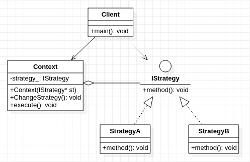

## **策略模式**
 

    /****************************************************************************************
    * 策略模式包括两类对象: 上下文对象,若干个策略(算法)对象
    * 上下文对象:  主要负责根据内容以及条件变化去选择并执行具体的策略(算法)
    * 策略对象:    具体策略(算法)实现
    * 将策略(算法)进行抽象,策略(算法)之间的差异通过扩展去完成,避免对原有策略(算法)的修改
    * 实现了对修改封闭,对扩展开放.设计上完美遵循开放封闭原则
    ****************************************************************************************/
     
```cpp
#include<stdio.h>

class IStrategy
{
    public:
        virtual void method() = 0;
};

class StrategyA:public IStrategy
{
    public:
        virtual void method(){
            printf("execute algorithmA\n");
        }
};

class StrategyB:public IStrategy
{
    public:
        virtual void method(){
            printf("execute algorithmB\n");
        }
};

class Context
{
    private:
        IStrategy* strategy_;
    public:
        Context(IStrategy* st): strategy_(st){
            //...................略
        }
        void ChangeStrategy(IStrategy* st){
            strategy_ = st;
        }
        void execute(){
            strategy_->method();
        }
};

int main(){
    IStrategy* st = new StrategyA();
    Context* ct = new Context(st);
    ct->execute();
    ct->ChangeStrategy(new StrategyB());
    ct->execute();
    return 0;
}
```