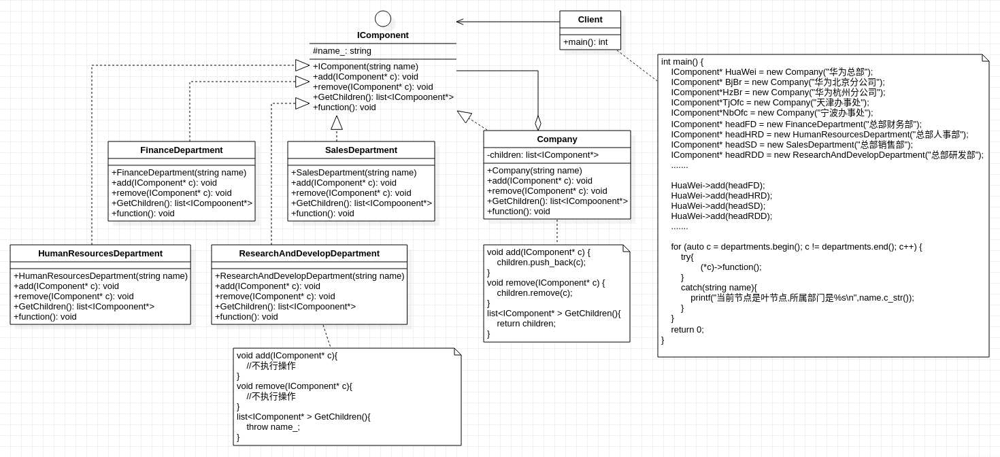

## **组合模式**

    /***************************************************************************************************************
    * 跟职责链模式类似,都是以数据结构的思想实现该模式,使用的数据结构中的树形结构实现
    * 设计特点:将树形结构用于设计模式,与职责链模式(链表结构)相似,二者均使用算法中常用的数据结构来进行模式设计
    * 应用场景:当系统设计满足“部分-整体”的关系时,类似的有:大学中的部门与学院,文件系统中的文件与文件夹
    * 总公司中的部门与分公司等满足树形结构以及部分关系,下面以华为公司组织架构进行举例:
    *                                                                                                           华为总部
    *                             北京分子司                                       财务部 人事部 销售部 研发部                                 杭州分公司
    * 财务部 人事部 销售部 研发部    天津办事处                                                                     财务部 人事部 销售部 研发部    宁波办事处
    *                                                          人事部 销售部                                                                                                                            人事部 销售部
    * 
    * 需要注意的是:组合模式分为透明式和安全式.二者区别:
    * 透明式:抽象节点包含所有公共接口(即:用于管理节点的接口与公共行为接口)
    *                优点:对于客户端来说,所有节点声明都可以使用抽象类去表示.不用区分叶节点与枝节点
    *                缺点:由于叶节点不应该具有管理节点的行为,相关方法的重载实现实质上是违背里氏代换原则
    * 安全式:将用于节点管理的接口,从抽象节点放到枝节点中,抽象节点仅包含节点的公共行为接口
    *                优点:对比透明式,叶节点不需要实现无关的节点管理的行为接口.继承关系满足里氏代换原则
    *                缺点:对于客户端来说,节点类型的声明需要由客户端具体指明
    **************************************************************************************************************/

## 透明式

    

```cpp
#include <list>
#include <iostream>
#include <string>
using namespace std;

// 透明式
class IComponent { 
    protected:
        string name_;
    public:
        IComponent(string name): name_(name){
            //.................略
        }
        virtual void add(IComponent* c) = 0;
        virtual void remove(IComponent* c) = 0;
        virtual list<IComponent* > GetChildren() = 0;
        virtual void function() = 0;
};

// 枝节点
class Company : public IComponent {
    private:
        list<IComponent* > children_;
    public:
        Company(string name):IComponent(name){
            //.................略
        }
        virtual void add(IComponent* c) { 
            children_.push_back(c); 
        }
        virtual void remove(IComponent* c) { 
            children_.remove(c);
        }
        virtual list<IComponent* > GetChildren(){
            return children_;
        }
        virtual void function() {
            cout << name_ << "执行职能:指挥/命令/管理/调用所属下级部门 "  << endl;  
            for (auto c = children_.begin(); c != children_.end(); c++) {
                (*c)->function();
            }   
        }
};

// 叶节点
class FinanceDepartment : public IComponent { 
    public:
        FinanceDepartment(string name):IComponent(name){
            //................略
        }
        virtual void add(IComponent* c){
            //不执行操作
        } 
        virtual void remove(IComponent* c){
            //不执行操作
        } 
        virtual list<IComponent* > GetChildren(){
            throw name_;
        }
        virtual void function() { 
            cout <<  name_ << "执行职能:财务结算"  << endl; 
        }
};

class HumanResourcesDepartment : public IComponent { 
    public:
        HumanResourcesDepartment(string name):IComponent(name){
            //................略
        }
        virtual void add(IComponent* c){
            //不执行操作
        } 
        virtual void remove(IComponent* c){
            //不执行操作
        } 
        virtual list<IComponent* > GetChildren(){
            throw name_;
        }
        virtual void function() { 
            cout <<  name_ << "执行职能:人才招聘"  << endl; 
        }
};

class SalesDepartment : public IComponent { 
    public:
        SalesDepartment(string name):IComponent(name){
            //................略
        }
        virtual void add(IComponent* c){
            //不执行操作
        } 
        virtual void remove(IComponent* c){
            //不执行操作
        } 
        virtual list<IComponent* > GetChildren(){
            throw name_;
        }
        virtual void function() { 
            cout <<  name_ << "执行职能:人才招聘"  << endl; 
        }
};

class ResearchAndDevelopDepartment : public IComponent { 
    public:
        ResearchAndDevelopDepartment(string name):IComponent(name){
            //................略
        }
        virtual void add(IComponent* c){
            //不执行操作
        } 
        virtual void remove(IComponent* c){
            //不执行操作
        } 
        virtual list<IComponent* > GetChildren(){
            throw name_;
        }
        virtual void function() {
            cout << name_ << "执行职能:产品研发"  << endl; 
        }
};

int main() { 
    IComponent* HuaWei = new Company("华为总部");
    IComponent* BjBr = new Company("华为北京分公司");
    IComponent*HzBr = new Company("华为杭州分公司");
    IComponent*TjOfc = new Company("天津办事处");
    IComponent*NbOfc = new Company("宁波办事处");

    IComponent* headFD = new FinanceDepartment("总部财务部");
    IComponent* headHRD = new HumanResourcesDepartment("总部人事部");
    IComponent* headSD = new SalesDepartment("总部销售部");
    IComponent* headRDD = new ResearchAndDevelopDepartment("总部研发部");

    IComponent* BjBrFD = new FinanceDepartment("北京分公司财务部");
    IComponent* BjBrHRD = new HumanResourcesDepartment("北京分公司人事部");
    IComponent* BjBrSD = new SalesDepartment("北京分公司销售部");
    IComponent* BjBrRRD = new ResearchAndDevelopDepartment("北京分公司研发部");

    IComponent* HzBrFD = new FinanceDepartment("杭州分公司财务部");
    IComponent* HzBrHRD = new HumanResourcesDepartment("杭州分公司人事部");
    IComponent* HzBrSD = new SalesDepartment("杭州分公司销售部");
    IComponent* HzBrRRD = new ResearchAndDevelopDepartment("杭州分公司研发部");

    IComponent* TjOfcHRD = new HumanResourcesDepartment("天津办事处人事部");
    IComponent* TjOfcSD = new SalesDepartment("天津办事处销售部");

    IComponent* NbOfcHRD = new HumanResourcesDepartment("宁波办事处人事部");
    IComponent* NbOfcSD = new SalesDepartment("宁波办事处销售部");
    
    HuaWei->add(headFD);
    HuaWei->add(headHRD);
    HuaWei->add(headSD);
    HuaWei->add(headRDD);

    HuaWei->add(BjBr);
    BjBr->add(BjBrFD);
    BjBr->add(BjBrHRD);
    BjBr->add(BjBrSD);
    BjBr->add(BjBrRRD);
    BjBr->add(TjOfc);
    TjOfc->add(TjOfcHRD);
    TjOfc->add(TjOfcSD);

    HuaWei->add(HzBr);
    HzBr->add(HzBrFD);
    HzBr->add(HzBrHRD);
    HzBr->add(HzBrSD);
    HzBr->add(HzBrRRD);
    HzBr->add(NbOfc);
    NbOfc->add(NbOfcHRD);
    NbOfc->add(NbOfcSD);

    list<IComponent*> departments = HuaWei->GetChildren();
    for (auto c = departments.begin(); c != departments.end(); c++) {
        try{
                (*c)->function();
        } 
        catch(string name){
            printf("当前节点是叶节点,所属部门是%s\n",name.c_str());
        }
    }

    return 0;
}
```
------------------------------------------------------------------------------------------------------------------

## 安全式

    

```cpp
#include <list>
#include <iostream>
#include <string>
using namespace std;

class IComponent { 
    protected:
        string name_;
    public:
        IComponent(string name){
            name_ = name;
        }
        virtual void function() = 0;
};

// 枝节点
class Company : public IComponent {
    private:
        list<IComponent* > children;
    public:
        Company(string name):IComponent(name){
            //................略
        }
        virtual void add(IComponent* c) { 
            children.push_back(c); 
        }
        virtual void remove(IComponent* c) { 
            children.remove(c);
        }
        virtual list<IComponent* > GetChildren(){
            return children;
        }
        virtual void function() {
            cout << name_ << "执行职能:指挥/命令/管理/调用所属下级部门 "  << endl;  
            for (auto c = children.begin(); c != children.end(); c++) {
                (*c)->function();
            }   
        }
};

// 叶节点
class FinanceDepartment : public IComponent { 
    public:
        FinanceDepartment(string name):IComponent(name){
            //................略
        }
        virtual void function() { 
            cout <<  name_ << "执行职能:财务结算"  << endl; 
        }
};

class HumanResourcesDepartment : public IComponent { 
    public:
        HumanResourcesDepartment(string name):IComponent(name){
            //................略
        }
        virtual void function() { 
            cout <<  name_ << "执行职能:人才招聘"  << endl; 
        }
};

class SalesDepartment : public IComponent { 
    public:
        SalesDepartment(string name):IComponent(name){
            //................略
        }
        virtual void function() { 
            cout <<  name_ << "执行职能:人才招聘"  << endl; 
        }
};

class ResearchAndDevelopDepartment : public IComponent { 
    public:
        ResearchAndDevelopDepartment(string name):IComponent(name){
            //................略
        }
        virtual void function() {
            cout << name_ << "执行职能:产品研发"  << endl; 
        }
};

int main() { 
    Company* HuaWei = new Company("华为总部");
    Company* BjBr = new Company("华为北京分公司");
    Company*HzBr = new Company("华为杭州分公司");
    Company*TjOfc = new Company("天津办事处");
    Company*NbOfc = new Company("宁波办事处");

    IComponent* headFD = new FinanceDepartment("总部财务部");
    IComponent* headHRD = new HumanResourcesDepartment("总部人事部");
    IComponent* headSD = new SalesDepartment("总部销售部");
    IComponent* headRDD = new ResearchAndDevelopDepartment("总部研发部");

    IComponent* BjBrFD = new FinanceDepartment("北京分公司财务部");
    IComponent* BjBrHRD = new HumanResourcesDepartment("北京分公司人事部");
    IComponent* BjBrSD = new SalesDepartment("北京分公司销售部");
    IComponent* BjBrRRD = new ResearchAndDevelopDepartment("北京分公司研发部");

    IComponent* HzBrFD = new FinanceDepartment("杭州分公司财务部");
    IComponent* HzBrHRD = new HumanResourcesDepartment("杭州分公司人事部");
    IComponent* HzBrSD = new SalesDepartment("杭州分公司销售部");
    IComponent* HzBrRRD = new ResearchAndDevelopDepartment("杭州分公司研发部");

    IComponent* TjOfcHRD = new HumanResourcesDepartment("天津办事处人事部");
    IComponent* TjOfcSD = new SalesDepartment("天津办事处销售部");

    IComponent* NbOfcHRD = new HumanResourcesDepartment("宁波办事处人事部");
    IComponent* NbOfcSD = new SalesDepartment("宁波办事处销售部");
    
    HuaWei->add(headFD);
    HuaWei->add(headHRD);
    HuaWei->add(headSD);
    HuaWei->add(headRDD);

    HuaWei->add(BjBr);
    BjBr->add(BjBrFD);
    BjBr->add(BjBrHRD);
    BjBr->add(BjBrSD);
    BjBr->add(BjBrRRD);
    BjBr->add(TjOfc);
    TjOfc->add(TjOfcHRD);
    TjOfc->add(TjOfcSD);

    HuaWei->add(HzBr);
    HzBr->add(HzBrFD);
    HzBr->add(HzBrHRD);
    HzBr->add(HzBrSD);
    HzBr->add(HzBrRRD);
    HzBr->add(NbOfc);
    NbOfc->add(NbOfcHRD);
    NbOfc->add(NbOfcSD);

    list<IComponent*> departments = HuaWei->GetChildren();
    for (auto c = departments.begin(); c != departments.end(); c++) {
        try{
                (*c)->function();
        } 
        catch(string name){
            printf("当前节点是叶节点,所属部门是%s\n",name.c_str());
        }
    }
    
    return 0;
}
```
