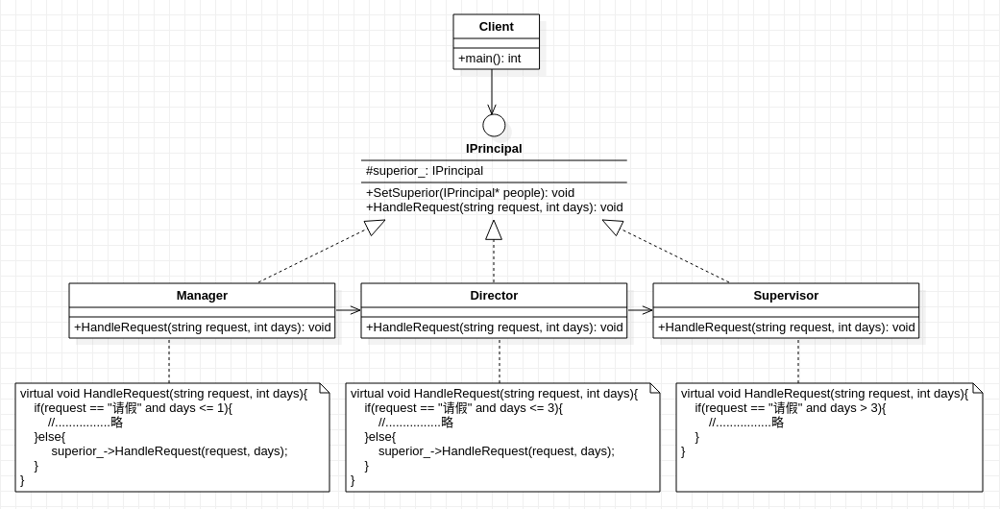

## **职责链模式**
     

    /***************************************************************************************************************
        * 职责链模式的重点在于:对(所发起的)请求的传递,以及由此所引起的接收者对象变化
        * 设计目的:当一个请求存在多个可以处理它的对象,且由于这些对象的处理方法,条件,权限存在差异,
        *          使得它们有机会参与对请求的处理时,可以使用该模式
        *  
        * 设计特点:将链表结构用于设计模式,与组合模式(树形结构)相似
        *          二者均使用算法中常用的数据结构来进行模式设计
        * 该模式常用场景包括:
        *      公司员工请假:在批假方面,部门各级负责人都拥有不同程度的权利,权限超出范围时交给上级领导处理
        *      程序异常处理:处理异常时,程序会根据异常类型决定是否由自己处理,不满足要求时交由下个程序处理*
        *      数据报文传送:接收报文时,每台计算机会将目标地址与自身地址进行匹配来决定是否接收该报文,若不匹配则丢弃
        * 个人看法:
        *      将行为的请求换成具有相应执行请求权限的对象更好
    ****************************************************************************************************************/

```cpp
#include<string>
using std::string;

class IPrincipal
{
    protected:
        IPrincipal* superior_;
    public:
        void SetSuperior(IPrincipal* people){
            superior_ = people;
        }
        virtual void HandleRequest(string request, int days) = 0;
};

class Supervisor:public IPrincipal
{
    public:
        virtual void HandleRequest(string request, int days){
            if(request == "请假" and days >3){
                //................略
            }
        }
};

class Director:public IPrincipal
{
    public:
        virtual void HandleRequest(string request, int days){
            if(request == "请假" and days <= 3){
                //................略
            }
            else{
                superior_->HandleRequest(request, days);
            }
        }
};

class Manager:public IPrincipal
{
    public:
        virtual void HandleRequest(string request, int days){
            if(request == "请假" and days <= 1){
                //................略
            }
            else{
                superior_->HandleRequest(request, days);
            }
        }
};

int main(){
    Manager* objA = new Manager();
    Director* objB = new Director();
    Supervisor* objC = new Supervisor();
    objA->SetSuperior(objB);
    objB->SetSuperior(objC);
    objA->HandleRequest("请假", 8);
}
```