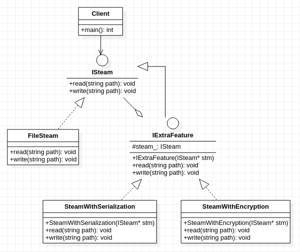

## **装饰器模式**
     

    /******************************************************************************************************************************************* 
    * 核心思想: 通过可以层层叠加附加功能,从对象ObA摇身一变变成对象ObjB,就像穿衣服一样
    * 关于对象变化的理解: 就像人穿衣服的过程
    *      没穿衣服(objA)->先穿内裤(objB=穿了内裤的objA)->再穿外裤(objC=穿了外裤的objB), 普通人 
    *      没穿衣服(objA)->先穿外裤(objB=穿了外裤的objA)->再穿内裤(objC=穿了内裤的objB), 超人
    *                         objA   ->           objB = wrap1(objA)              ->   objC = wrap2(objB) 
    * 装饰器一般分为类装饰器和函数装饰器，装饰器模式处理的就是类装饰器，函数装饰器利用函数指针(或函数句柄,说法不一样但意思相同),
    * 将函数对象(函数名)从原本的函数A重定向函数B  即: funB= wrap(funA)
    *  关于python 的装饰器的理解
    *      事实上python的装饰器在实现上更符合"装饰"这一概念.这是由于python的特性:变量名可以重复使用(但C++不可以)
    *      这使得不改变"对象ObjA"的情况下,更变"对象ObjA"的功能,就像装饰一样,对ObjA的功能进行装饰
    *      (但其实只是名称一样而已,实际不是同一个对象,因为内存地址发生改变) 
        *******************************************************************************************************************************************/


```cpp
#include<string>
using std::string;


class ISteam
{
    public:
        virtual void read(string path) = 0;
        virtual void write(string path) = 0;
};

class FileSteam:public ISteam
{
    public:
        virtual void read(string path){
            printf("read file from %s",path.c_str());
        }
        virtual void write(string path){
            printf("write file from %s",path.c_str());
        }
};

// 这里的装饰器类最主要的目的是把 ISteam* steam 这个对象提到公共部分,如果不提的话,这个类可以不写
class IExtraFeature:public ISteam  
{
    protected:   // 使用保护成员,这样子类继承它后才能正常使用
        ISteam* steam_;
    public:
        IExtraFeature(ISteam* stm):steam_(stm){
            //................略
        }
        virtual void read(string path) = 0;
        virtual void write(string path) = 0;
};

// 额外功能1, 加密功能
class SteamWithEncryption:public IExtraFeature
{
    public:
        SteamWithEncryption(ISteam* stm):IExtraFeature(stm){
            //................略
        }
        virtual void read(string path){
            printf("all content have been encrypted");
            steam_->read(path);//或者this->IExtraFeature::read(path);如果有具体化的代码

        }
        virtual void write(string path){
            printf("all content have been encrypted");
            steam_->write(path);//或者this->IExtraFeature::write(path);如果有具体化的代码
        }
};

//额外功能2, 对象序列化功能
class SteamWithSerialization:public IExtraFeature
{
    public:
        SteamWithSerialization(ISteam* stm):IExtraFeature(stm){
            //................略
        }
        virtual void read(string path){
            printf("ReadObject serialization");
            steam_->read(path);//或者this->IExtraFeature::read(path);如果有具体化的代码
        }
        virtual void write(string path){
            printf("WriteObject serialization ");
            steam_->write(path);//或者this->IExtraFeature::write(path);如果有具体化的代码
        }
};

int main()
{
    ISteam* fileSteam = new FileSteam();
    fileSteam->read("/home/.../...");
    
    IExtraFeature* fileSteamWithEncry = new SteamWithEncryption(fileSteam);
    fileSteamWithEncry->read("/home/.../...");
}
```