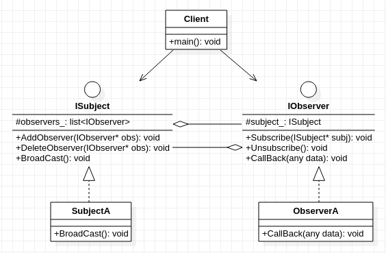

## **观察者模式**
     

    /*****************************************************************************************************************
    * 观察者模式又称为发布-订阅(Publish/Subscribe)模式, 模型-视图(Model/View模式),源-监听器(Source/Listener)模式
    * 常用场景:邮件/RSS订阅,天气预报,广播通信等.
    *      主题(Subject)有时候又被称为发布者, 模型, 源. 属于被观察者
    *      观察者(Observer)有时候又被称为订阅者, 视图, 监听器
    * 该模式充分体现了依赖倒置原则,模块与模块之间两者都应该依赖对方的抽象,不依赖于实现细节
    * 
    * 初学者在模式学习上的常见错误理解(主要是由于网上对该模式不同实现所造成的): 
    *          1,违背人类对于观察者(订阅者)的直观理解(观察者是人,被观察者是物)
    *          2,被观察者(主题)通过注册去添加需要的通知的观察者(订阅者),可以理解.
    *                  但观察者不能自行添加想要的被观察者(主题).不能体现身为观察者(订阅者)的职责.
    * 
    * 个人看法: 
    *          1,被订阅的主题可以使用单例模式(饿汉式)避免话题的手动创建.       
    *          2,讨论：模式原本的设计是一个主题对应多个订阅者,但一个订阅者最多只能有一个主题
    *                          有没有可能实现一个订阅者对应多个主题,即多主题对多订阅者的方式
    *          答：有，观察者模式的分布式实现：假设有一个程序，其所有的组件都变成了发布者，它们之间可以相互建立
    *                  动态连接。这样程序中就没有中心化的中介者对象， 而只有一些分布式的观察者。即：一个对象既是观察者
    *                  又是发布者，多个观察者(发布者)对应多个发布者(观察者)。去中心化实现
    *****************************************************************************************************************/

```cpp
#include <list>
#include <boost/any.hpp>

class IObserver; //前向引用声明, 出现相互依赖时使用,简单理解就是类的声明

class ISubject
{
    protected:
            std::list<IObserver*> observers_;
    public:
        void AddObserver(IObserver* obs){
            observers_.push_back(obs);
        }
        void DeleteObserver(IObserver* obs){
            observers_.remove(obs);
        }
        virtual void BroadCast() = 0;
};

class IObserver
{
    protected:
        ISubject* subject_;
    public:
        void Subscribe(ISubject* subj){             //由观察者自行添加需要订阅的主题
            subject_ = subj;
            subject_->AddObserver(this);            //实际上由主题对象去为当前的观察者进行注册
        }
        void Unsubscribe(){                                    //由观察者自行取消需要订阅的主题
            if(subject_ != nullptr){
                subject_->DeleteObserver(this);  //实际上由主题对象去给当前的观察者进行退订
                subject_ = nullptr;
            }
        }
        virtual void CallBack(boost::any data) = 0; 
};

class SubjectA:public ISubject
{
    public:
        virtual void BroadCast() {
            int data_ = 10; //假设出于某种原因,数据发生了变化
            for (auto obs = observers_.begin();obs != observers_.end() ;++obs) {
                (*obs)->CallBack(data_); 
            }
        }
};

class ObserverA:public IObserver
{
    public:
        virtual void CallBack(boost::any data) {
            printf(" 收到数据 %d, 执行相关操作\n",boost::any_cast<int>(data));
        }
};

int main(){
    ISubject* subject = new SubjectA();
    IObserver* observer = new ObserverA();
    observer->Subscribe(subject);    
    subject->BroadCast();  //当subject的状态发生变化时,进行广播,订阅者对相应的行为进行响应
    observer->Unsubscribe();
    return 0;
}
```