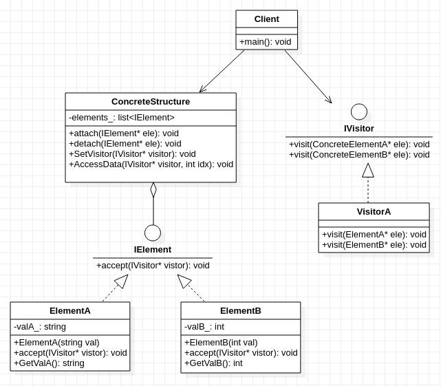

## **访问者模式**
   

    /**********************************************************************************************************
     * 从设计思路来讲,它与迭代器模式本质上是一致的,都是把数据和操作进行分离,满足单一职责原则
     * 
     * 常用场景:对象结构包含很多类型的对象. 但可以通过同一个方法visit()获得结构内的数据
     *                    就像python的列表,即使列表中含有不同类型,也能通过操作符[]获取到列表中的(不同类型)数据
     * 
     * 个人理解:访问者模式本质上以设计模式的方式去实现python的列表及其元素访问行为
     * 
     * 访问者模式与迭代器模式的差别:作用的对象与目的不同.
     *      迭代器的作用的对象是针对容器本身,目的是其内部数据的遍历,比如从这个元素跳到下一个元素,是一种结构上的遍历行为
     *      访问者的作用的对象是容器的内部数据,目的是内部数据的获取.比如查看该容器的内部元素的值,是一种数据获取行为
     * 
     * 缺点:抽象访问者依赖于具体元素类,违背依赖倒置原则
     *********************************************************************************************************/
     
```cpp
#include <list>
#include <stdio.h>
#include <string>

class IVisitor;
class ElementA;
class ElementB;

class IElement
{
    public:
        virtual void accept(IVisitor* vistor) = 0 ;
};

class IVisitor
{
    public:
        virtual void visit(ElementA* ele) = 0;
        virtual void visit(ElementB* ele) = 0;
};

class ElementA:public IElement
{
    private:
        std::string valA_;
    public:
        ElementA(std::string val): valA_(val){
            //..............略
        }       
        virtual void accept(IVisitor* vistor){
            //..........略
            vistor->visit(this);
        }
        std::string GetValA(){
            return valA_;
        }
};

class ElementB:public IElement
{
    private:
        int valB_;
    public:
        ElementB(int val): valB_(val){
             //..............略
        }
        virtual void accept(IVisitor* vistor){
            //..............略
            vistor->visit(this);
        }
        int GetValB(){
            return valB_;
        }
};

class VisitorA:public IVisitor
{
    public:
        virtual void visit(ElementA* ele){
            printf("I got the element value is %s by visitorA\n",ele->GetValA().c_str());
        }
        virtual void visit(ElementB* ele){
            printf("I got the element value is %d by visitorA\n",ele->GetValB());
        }
};

class ConcreteStructure
{
    private:
        std::list<IElement*> elements_;
    public:
        void attach(IElement* ele){
            elements_.push_back(ele);
        }
        void detach(IElement* ele){
            elements_.remove(ele);
        }
        void AccessData(IVisitor* visitor, int idx){
            for( auto e = elements_.begin(); e != elements_.end(); ++e) {
                if(idx==0) {
                    (*e)->accept(visitor);
                }
                --idx;
            }
        }
};

int main()
{
    ConcreteStructure* cs = new ConcreteStructure();
    IElement* eleA = new ElementA("lixianqiang");
    IElement* eleB = new ElementB(12);
    IVisitor* vis = new VisitorA();
    cs->attach(eleA);
    cs->attach(eleB);
    cs->AccessData(vis,0);
    cs->AccessData(vis,1);
}
```