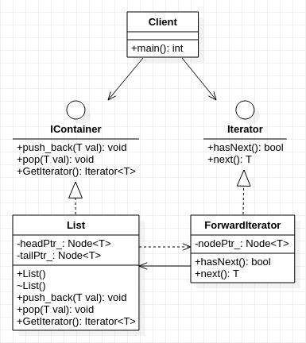

## **迭代器模式**

    /************************************************************************************************************* 
    * 迭代器的两种实现:迭代器模式(面向对象),STL迭代器(泛型编程):
    *          迭代器模式: 基于(纯)虚函数的实现 属于运行时多态(即运行时动态绑定)
    *                  运行过程存在地址跳转的问题，存在性能上的损失
    *                  该模式实现将数据的存储和访问(遍历行为)分离,满足"单一职责原则"和"开闭原则"
    *          STL迭代器: 基于类(函数)模板方法 属于编译时多态
    *                  在编译阶段就把参数类型固定起来,不存在性能损失
    *                  由于数据的存储和访问(遍历行为)都放在(容器类)一起实现,修改时容易会违背"开闭原则"
    * 个人看法:该设计模式本身没有考虑类型的变化,使用模板方法对数据类型进行参数化,可以减少类型重载
    *                    虽然使用了模板,但因为有(纯)虚函数,所以其实还是属于面向对象
    * 需要注意的是:
    *          迭代器模式:容器类的实现不是模式所必须的,我们完全可以为已有的容器类实现自己迭代器而不需要自定义容器
    *          STL迭代器:迭代器本质上是智能指针,它将指针进行了一层封装,简单理解就是:智能指针==指针的指针
    * 数据,容器,迭代器之间的关系
    *          数据:在具有一定组织结构形式管理下的最小单元,比如:链表list,向量vector中的节点数据
    *          容器:用于存放数据,并拥有管理这些数据的方法,如:增加push_back(),删除pop()等
    *                    (不一定)拥有访问这些数据的方法,如:向量vector拥有支持随机访问的函数at(),而list没有
    *          迭代器:利用其拥有的组织结构形式与数据间的前后联系,在不依赖容器已有方法下,实现对其内部数据的(遍历)访问
    *                         比起链表容器,vector容器的迭代器实现能更直观体现这句话的意思
    ***************************************************************************************************************/

## 迭代器模式

  

```cpp
#include <stdio.h>

template <typename T> class Iterator;//类模板声明, 前向引用声明
template <typename T> class ForwardIterator;

template <typename T>
class IContainer
{
    public:
        virtual void push_back(T val) = 0;
        virtual void pop(T val) = 0;
        virtual Iterator<T>* GetIterator() = 0;
};

template <typename T>
class Iterator
{
    public:
        virtual bool hasNext() = 0;
        virtual T  next() = 0 ;
};

//简单理解:就是Node类+List类组成一个完整容器(当然实际并非如此)
template<typename T>
struct Node {
    T val;
    Node<T>* nextPtr;
    Node(): nextPtr(nullptr) {
        //..............略
    }
    Node(T val, Node<T>* obj = nullptr): val(val), nextPtr(obj) {
        //..............略
    }
};

template <typename T>
class List: public IContainer<T>
{
    private:
        Node<T>* headPtr_;
        Node<T>* tailPtr_;
    public:
        List(): headPtr_(nullptr), tailPtr_(nullptr){
            //..................略
        }
        ~List(){
            delete headPtr_;
            delete tailPtr_;
        }
        //从链表尾部插入元素
        virtual void push_back(T val) {
            if (headPtr_ == nullptr) {
                headPtr_ =  tailPtr_ = new Node<T>(val);
                headPtr_->nextPtr = nullptr;
                tailPtr_->nextPtr = nullptr;
            } 
            else {
                tailPtr_->nextPtr = new Node<T>(val);
                tailPtr_ = tailPtr_->nextPtr;
                tailPtr_->nextPtr = nullptr;
            }
        }
        // virtual void push_back(Node<T>* obj){
        //     if(headPtr_ == nullptr){
        //         headPtr_ = tailPtr_ = obj;
        //         headPtr_->nextPtr = nullptr;
        //         tailPtr_->nextPtr = nullptr;
        //     }
        //     else{
        //         tailPtr_->nextPtr = obj;
        //         tailPtr_ = tailPtr_->nextPtr;
        //         tailPtr_->nextPtr = nullptr;
        //     }
        // } 
        //从链表中删除元素
        virtual void pop(T val) {
            Node<T> *currPtr, *tmpPtr;
            currPtr = tmpPtr = headPtr_;
            if (currPtr == NULL) {
                return;
            }
            while (currPtr != NULL && currPtr->val != val) {
                tmpPtr = currPtr;
                currPtr = currPtr->nextPtr;
            }
            tmpPtr->nextPtr = currPtr->nextPtr;
        }    
        // virtual void pop(Node<T>* obj){
        //     Node<T> *currPtr, *tmpPtr;
        //     currPtr = tmpPtr = headPtr_;
        //     if (currPtr == NULL) {
        //         return;
        //     }
        //     while (currPtr != NULL && currPtr->val != obj->val) {
        //         tmpPtr = currPtr;
        //         currPtr = currPtr->nextPtr;
        //     }
        //     tmpPtr->nextPtr = currPtr->nextPtr;
        // }
        virtual Iterator<T>* GetIterator(){
            return new ForwardIterator<T>(headPtr_);
        } 
};

template<typename T>
class ForwardIterator: public Iterator<T>
{
    private:
        Node<T>* nodePtr_;
    public:
        ForwardIterator(Node<T>* obj = nullptr): nodePtr_(obj){
            //...............略
        }
        virtual bool hasNext(){
            if(nodePtr_ == nullptr){
                return false;
            }
            return true;
        }
        virtual T next(){
            if(hasNext()){
                Node<T>* tmpPtr = nodePtr_;
                nodePtr_ = nodePtr_->nextPtr;
                return tmpPtr->val;
            }
            else{          
                printf("已经是最后一个了,不要再next了,再next也没有啦\n");
                return T();
            }
        }
};

int main(){
    IContainer<int>* container = new List<int>();
    container->push_back(1);
    container->push_back(1111);
    container->push_back(120);
    container->pop(120);
    Iterator<int>* iter = container->GetIterator();
    while(iter->hasNext()){
        printf("val is %d\n",iter->next());
    }
}
```

------------------------------------------------------------------------------------------------------------------------------------------------

## STL迭代器

    /*****************************************************************************
    * STL的链表容器及其迭代器实现
    * STL迭代器本质是智能指针,它对指针进行了一层封装,简单理解就是指针套指针
    * 参考链接:
    *      <https://blog.csdn.net/sinat_35512245/article/details/54600187>
    *      <https://www.cnblogs.com/wxquare/p/4699429.html>
    *  
    * 关于STL的vector容器及其迭代器实现
    *      参考链接: <https://juejin.im/post/6844904165265653773>
    ******************************************************************************/

```cpp
#include <iostream>

template<typename T>
struct Node {
    T val;
    Node<T>* nextPtr;
    Node(): nextPtr(nullptr) {
        //..............略
    }
    Node(T val, Node<T>* obj = nullptr): val(val), nextPtr(obj) {
        //..............略
    }
};

template<typename T>
class List {
    private:
        Node<T>* headPtr_;
        Node<T>* tailPtr_;
    public:
        List(): headPtr_(nullptr), tailPtr_(nullptr){
            //..................略
        }
        ~List(){
            delete headPtr_;
            delete tailPtr_;
        }
        //从链表尾部插入元素
        void push_back(T val) {
            if (headPtr_ == nullptr) {
                headPtr_ =  tailPtr_ = new Node<T>(val);
                headPtr_->nextPtr = nullptr;
                tailPtr_->nextPtr = nullptr;
            } 
            else {
                tailPtr_->nextPtr = new Node<T>(val);
                tailPtr_ = tailPtr_->nextPtr;
                tailPtr_->nextPtr = nullptr;
            }
        }        
        // void push_back(Node<T>* obj){
        //     if(headPtr_ == nullptr){
        //         headPtr_ = tailPtr_ = obj;
        //         headPtr_->nextPtr = nullptr;
        //         tailPtr_->nextPtr = nullptr;
        //     }
        //     else{
        //         tailPtr_->nextPtr = obj;
        //         tailPtr_ = tailPtr_->nextPtr;
        //         tailPtr_->nextPtr = nullptr;
        //     }
        // }
        //从链表中删除元素
        void pop(T val) {
            Node<T> *currPtr, *tmpPtr;
            currPtr = tmpPtr = headPtr_;
            if (currPtr == NULL) {
                return;
            }
            while (currPtr != NULL && currPtr->val != val) {
                tmpPtr = currPtr;
                currPtr = currPtr->nextPtr;
            }
            tmpPtr->nextPtr = currPtr->nextPtr;
        }
        // void pop(Node<T>* obj){
        //     Node<T> *currPtr, *tmpPtr;
        //     currPtr = tmpPtr = headPtr_;
        //     if (currPtr == NULL) {
        //         return;
        //     }
        //     while (currPtr != NULL && currPtr->val != obj->val) {
        //         tmpPtr = currPtr;
        //         currPtr = currPtr->nextPtr;
        //     }
        //     tmpPtr->nextPtr = currPtr->nextPtr;
        // }
        //前向迭代器类
        class Iterator
        {
            private:
                Node<T>* nodePtr_;
            public:
                Iterator(Node<T>* obj = nullptr) : nodePtr_(obj) {
                    //............略
                }
                //运算符重载 
                T& operator*() const {
                    return nodePtr_->val;
                }
                Node<T>* operator->() const {
                    return nodePtr_;
                }
                Iterator& operator++() {
                    nodePtr_ = nodePtr_->nextPtr;
                    return *this;
                }
                Iterator operator++(int) {
                    Node<T>* tmpPtr = nodePtr_;
                    nodePtr_ = nodePtr_->nextPtr;
                    return Iterator(tmpPtr);
                }
                bool operator==(const Iterator& iter) const {
                    return iter.nodePtr_ == this->nodePtr_;
                }
                bool operator!=(const Iterator& iter) const {
                    return iter.nodePtr_ != this->nodePtr_;
                }
        };
        //返回链表头部指针
        Iterator begin() const {
            return Iterator(headPtr_);
        }
        //返回链表尾部指针
        Iterator end() const {
            return Iterator(tailPtr_->nextPtr);
        }
        //打印链表元素
        void print(std::ostream &os = std::cout) const {
            for (Node<T> *ptr = headPtr_; ptr != tailPtr_->nextPtr ; ptr = ptr->nextPtr)
                std::cout << ptr->val << " ";
            os << std::endl;
        }
};

int main() {
    List<int> xl;
    xl.push_back(1);
    xl.push_back(2);
    xl.pop(2);
    for (List<int>::Iterator it = xl.begin(); it != xl.end(); ++it) {
        std::cout << *it << " ";
    }
    return 0;
}
```