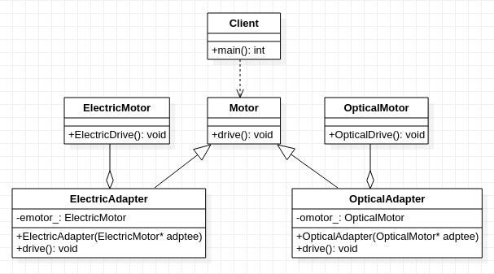

## **适配器模式**

    /**********************************************************************************************************************
    * 适配器模式(Adapter Model)别名又叫包装器模式(Wrapper Model)
    * 
    * 模式动机:客户端/用户希望通过调用目标接口去实现期望的功能.现有的接口可以满足客户端/用户的功能需求
    *                  但是它所提供的接口与目标接口存在兼容性问题(如:方法名不一致,参数类型不一样等),要想使用现有的接口实现.
    *                  就需要一个合适的转换器,将客户端/用户对目标接口的调用转换成对现有类的接口调用
    * 
    * 模式包含三类对象:目标类对象,适配者对象,适配器对象
    *      目标类对象(Target):客户端/用户需要调用的目标接口对象
    *      适配者对象(Adaptee):满足功能需求,但与目标接口不兼容的现有类对象
    *      适配器对象(Adapter):实现接口转换功能的包装器对象
    * 
    * 适配器模式有两种实现形式:类适配器, 对象适配器
    *      类适配器
    *              核心思路:采用多重继承,同时继承目标类和适配者类,然后在重载目标类接口时,在内部调用适配者类的接口
    *              缺点:增加类与类之间的耦合度,由于涉及多重继承,要求开发者本身清楚了解各个接口的构成
    *      对象适配器
    *              核心思路:只继承目标类,将适配者对象作为参数传入,然后在重载目标类接口时,在内部调用适配者对象的接口
    * 
    * 由于涉及到父类(目标类)函数接口的重载,违背里氏代换原则,设计初期不建议使用
        **********************************************************************************************************************/

## 对象适配器

 

```cpp
#include<string>
using std::string;

//适配者类 电能发动机
class ElectricMotor
{
    public:
        void ElectricDrive(){  // 待适配接口 (该接口方法名与目标接口的不一致)
            printf("Use electric energy to drive cars\n"); 
        }
}; 

//适配者类 光能发动机
class OpticalMotor
{
    public:
        void OpticalDrive(){ // 待适配接口 (该接口方法名与目标接口的不一致)
            printf("Use light energy to drive cars\n"); 
        }
};

//目标类
class Motor
{
    public:
        virtual void drive()=0; //目标接口(客户端/用户通过调用目标接口去访问它所提供的服务)
};

//对象适配器 电能适配器 
class ElectricAdapter :public Motor
{
    private:
        ElectricMotor* emotor_; 
    public:
        ElectricAdapter(ElectricMotor* adptee): emotor_(adptee){
            //............略
        }
        void drive(){ 
            emotor_->ElectricDrive(); //在重载目标类接口时,在内部调用适配者对象的函数接口
        }
};

//对象适配器 光能适配器 
class OpticalAdapter :public Motor
{
    private:
        OpticalMotor* omotor_; 
    public:
        OpticalAdapter(OpticalMotor* adptee): omotor_(adptee){
            //............略
        }
        void drive(){
            omotor_->OpticalDrive(); //在重载目标类接口时,在内部调用适配者对象的函数接口
        }
};

int main()
{
    ElectricMotor* elemotor = new ElectricMotor(); 
    Motor* motor = new ElectricAdapter(elemotor); 
    motor->drive();
}

```  

--------------------------------------------------------------------------------------------------------------------------

## 类适配器

   

```cpp
#include<string>
using std::string;

//适配者类 电能发动机
class ElectricMotor
{
    public:
        void ElectricDrive(){  // 待适配接口 (该接口方法名与目标接口的不一致)
            printf("Use electric energy to drive cars\n"); 
        }
}; 

//适配者类 光能发动机
class OpticalMotor
{
    public:
        void OpticalDrive(){ // 待适配接口 (该接口方法名与目标接口的不一致)
            printf("Use light energy to drive cars\n"); 
        }
};

//目标类
class Motor
{
    public:
        virtual void drive()=0; //目标接口(客户端/用户通过调用目标接口去访问它所提供的服务)
};

//类适配器 电能适配器 
class ElectricAdapter :public Motor, public ElectricMotor
{
    public:
        void drive(){
            this->ElectricDrive(); //在重载目标类接口时,在内部调用适配者类的接口
        }
};

//类适配器 光能适配器 
class OpticalAdapter :public Motor, public OpticalMotor
{
    public:
        void drive(){
            this->OpticalDrive(); //在重载目标类接口时,在内部调用适配者类的接口
        }
};

int main()
{
    Motor* motor = new ElectricAdapter();
    motor->drive();
}
```