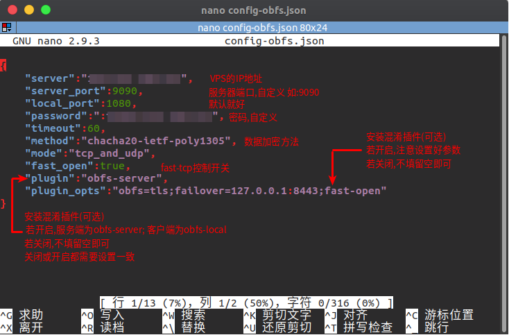
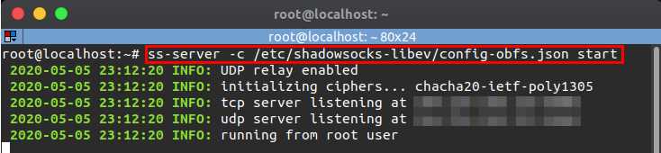
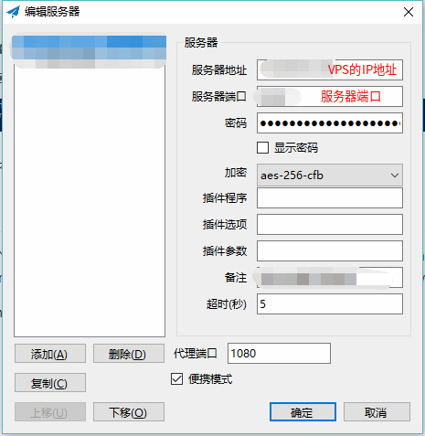
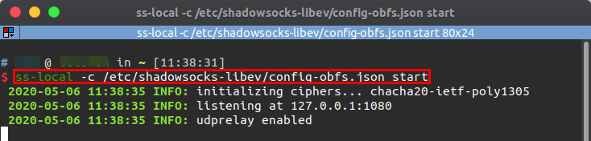

## ShadowSocks-libev安装教程 ##
> ShadowSocks-libev是ShadoSocks的C++版本  
> 目前教程只针对 Ubuntu18.04 进行测试  
> 想要有更具体的了解，请参考ShadowSocks-libev的[GitHub主页](https://github.com/shadowsocks/shadowsocks-libev) 
<font size="3">
本教程包括以下几个部分:  

+ **服务端**
+ **客户端**
+ **自启动配置**
+ **疑难解答**
************************************************************************************************************************************************
#### 安装ShadowSocks-libev ####
>   **Note**: 以下步骤均适用于服务端与客户端, 但注意指令的执行权限

**脚本安装**
```
git clone https://github.com/shadowsocks/shadowsocks-libev.git  
cd shadowsocks-libev  
git submodule update --init --recursive  
mkdir -p ~/build-area/  
cp ./scripts/build_deb.sh ~/build-area/  
cd ~/build-area
./build_deb.sh  # 一键安装脚本
```
************************************************************************************************************************************************
### 服务端 ###
#### 配置ShadowSocks-libev服务 ####
修改配置文件，执行以下指令
```
nano /etc/shadowsocks-libev/config-obfs.json
```  
<div align=center></div>

按 <kbd>Ctrl</kbd>+<kbd>o</kbd> 保存修改;  
按 <kbd>Enter</kbd> 　确定修改;  
按 <kbd>Ctrl</kbd>+<kbd>x</kbd> 退出编辑.  

**个人配置参考**
```
    {
        "server":"x.x.x.x",
        "server_port":9090,
        "local_port":1080,
        "password":"x.x.x.x",
        "timeout":60,
        "method":"chacha20-ietf-poly1305",
        "mode":"tcp_and_udp",
        "fast_open":false,
        "plugin":"obfs-server",
        "plugin_opts":"obfs=http;"
    }
```

### 启动ShadowSocks-libev服务 ###
```
ss-server -c /etc/shadowsocks-libev/config-obfs.json start > /dev/null 2>&1
```
<div align=center></div>

************************************************************************************************************************************************
### 客户端 ###
#### 配置Window客户端 ####
<div align=center></div>

#### 配置Ubuntu客户端 ####
修改配置文件
具体配置方法,请参考**配置ShadowSocks-libev服务**  

**个人配置参考**
```
    {
        "server":"x.x.x.x",
        "server_port":9090,
        "local_port":1080,
        "password":"xxxxxxx",
        "timeout":60,
        "method":"chacha20-ietf-poly1305",
        "mode":"tcp_and_udp",
        "fast_open":false,
        "plugin":"obfs-local",
        "plugin_opts":"obfs=http;obfs-host=www.baidu.com"
    }
```
#### 启动ShadowSocks-libev客户端 ####
```
nohup ss-local -c /etc/shadowsocks-libev/config-obfs.json start > /dev/null 2>&1 & 
```
<div align=center></div>

************************************************************************************************************************************************
### 自启动设置 ###
>   tips:在实际测试中，配置config.json该参数文件并不能让SS的服务正常生效，而config-obfs.json可以自启动使用Systemd的方式,不再使用sysVinit,测试只在Ubuntu18.04系统下进行

服务端  
```
systemctl enable shadowsocks-libev-server@　　　　#从/lib/systemd/system/shadowsocks-libev-server@.service 创建一个软链接到 /etc/systemd/system/multi-user.target.wants文件夹下
```
客户端  
```
sudo systemctl enable shadowsocks-libev-local@　　#从/lib/systemd/system/shadowsocks-libev-local@.service 创建一个软链接到 /etc/systemd/system/multi-user.target.wants文件夹下
```
---------------------------------------------------------------------------------------
## 疑难解答 ##
</font>
