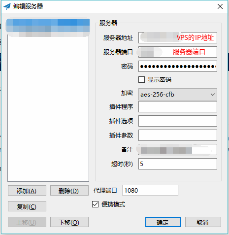

## ShadowSock安装教程 ##
>   Shadowsocks 俗称 小飞机
>   python语言编写  
>   VPS作为服务端,本地终端(手机/电脑/pad)作为客户端  
>   原则上, Linux端, 其服务端和客户端是安装步骤相同,只是启动指令略有不同
>   选择加密协议上,建议选择较新的协议,不推荐使用默认协议; 推荐使用chacha20-ietf-poly1305 或者 xchacha20-ietf-poly1305  
<font size="3">
本教程包括以下几个部分:

+ **服务端**
+ **客户端**
+ **自启动配置**
+ **疑难解答**
************************************************************************************************************************************************
#### 安装Shadowsocks ####
>   **Note**: 以下步骤均适用于服务端与客户端, 但注意指令的执行权限

**pip安装**
```
apt-get install python-pip  
pip install shadowsocks
```
**apt-get安装**  
```
apt-get install shadowsocks
```
************************************************************************************************************************************************
### 服务端 ###
#### 配置Shadowsocks服务 ####
修改配置文件，执行以下指令  
> **Note**: 如果使用pip方式进行安装需要自己编写config.json

```
nano /etc/shadowsocks/config.json
```
<div align=center></div> 

按<kbd>Ctrl</kbd>+<kbd>o</kbd> 保存修改;   
按<kbd>Enter</kbd>  确定修改;   
按<kbd>Ctrl</kbd>+<kbd>x</kbd> 退出编辑.   
个人配置参考
```
    {
        "server":"x.x.x.x",
        "server_port":8388,
        "local_address": "127.0.0.1",
        "local_port":1080,
        "password":"xxxxxxx",
        "timeout":300,
        "method":"chacha20-ietf-poly1305",
        "fast_open": false,
        "workers": 1,
        "prefer_ipv6": false
    }
```    
### 启动ShadowSocks服务 ###
```
ssserver -c /etc/shadowsocks/config.json start > /dev/null 2>&1
```
<div align=center></div>

************************************************************************************************************************************************
### 客户端 ###
#### 配置Window客户端 ####
<div align=center></div>
  
#### 配置Ubuntu客户端 ####
修改配置文件，执行以下指令
> note: 如果使用pip方式进行安装需要自己编写config.json

修改配置文件
具体配置方法,请参考**配置ShadowSocks服务**  
个人配置参考
```
    {
        "server":"x.x.x.x",
        "server_port":8388,
        "local_address": "127.0.0.1",
        "local_port":1080,
        "password":"xxxxxxx",
        "timeout":300,
        "method":"chacha20-ietf-poly1305",
        "fast_open": false,
        "workers": 1,
        "prefer_ipv6": false
    }
```
#### 启动ShadowSocks客户端 #### 
```
sslocal -c /etc/shadowsocks/config.json start > /dev/null 2>&1
```
<div align=center></div>

************************************************************************************************************************************************
### 自启动配置 ###
> Ubuntu自启动方式有 sysVinit 和 Systemd 这两种, 自Ubuntu18.04起采用Systemd自启动, 请自行根据系统版本选择相应的启动配置  

Ubuntu 16.04  
服务端
```
echo 'ssserver -c /etc/shadowsocks/config.json start' >> /etc/rc.local
```
客户端
```
sudo echo 'sslocal -c /etc/shadowsocks/config.json start' >> /etc/rc.local
```
Ubuntu 18.04  
创建自启脚本
```
nano /etc/systemd/system/shadowsocks.service
```
编辑shadowsocks.service, 内容如下:  
```
    [Unit]
    Description=Shadowsocks Client Service
    After=network.target
    [Service]
    Type=simple
    User=root
    ExecStart=/usr/bin/ssserver -c /etc/Shadowsocks/config.json  #客户端换成: /usr/bin/sslocal -c /etc/Shadowsocks/config.json
    [Install]
    WantedBy=multi-user.target
```
自启动设置, 服务端 与 客户端 均执行以下指令
```
systemctl enable /etc/systemd/system/shadowsocks.service
```
************************************************************************************************************************************************
## 疑难解答 ##
问题: 出现类似 `ERROR    method chacha20-ietf-poly1305 not supported` 的情况  
原因: 没有安装相应的加密库  
解决办法: `apt install libsodium-dev`, 然后重启  
</font>
