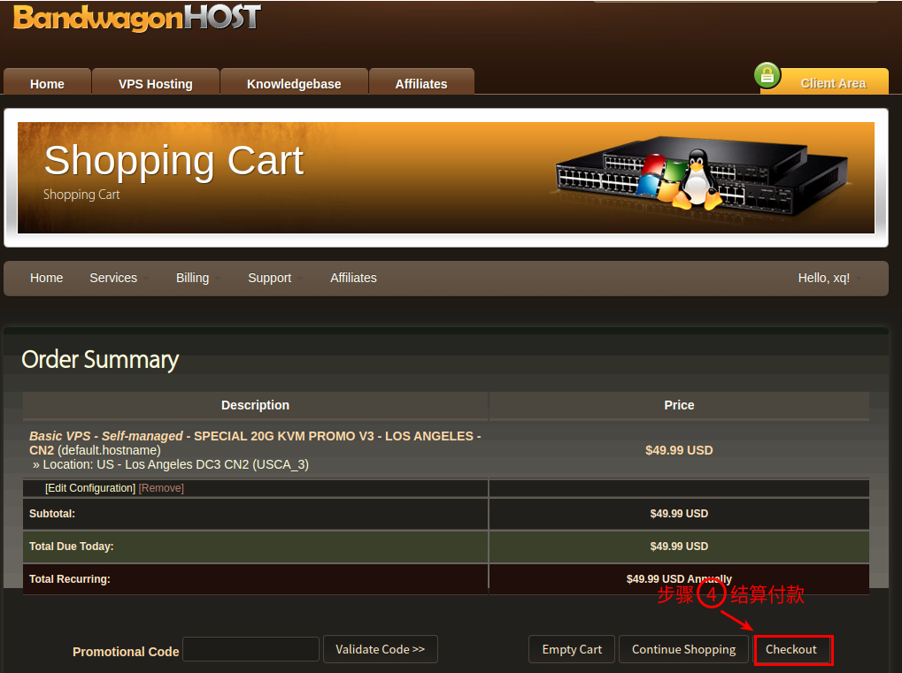

搬瓦工注册教程
==================================================================================================================
<font size="5">
本教程以搭建平台将进行科（番）学（羽）上（土）网（蔷）  
包括以下几个部分:  

+ **VPS申请**
+ **安装系统**
+ **远程登录**
*******************************************************************************************************************
## VPS申请 ##
>   VPS 全称 Virtual Private Server 即:虚拟专用服务器  

打开搬瓦工[官网](https://bandwagonhost.com/)/[镜像网站](https://bwh88.net/)  
**1.  注册账号**
    <div align=center></div>
    <div align=center></div>
    
**2.  登录账号**  
    <div align=center></div>
    
**3.  选择VPS服务**  
    <div align=center></div>
    <div align=center></div>
    <div align=center></div>
    <div align=center></div>
    <div align=center></div>
    Alipay就是支付宝，如果有paypal也可以，付款完成后会给你注册邮箱发送信息，包括ip、端口、root密码等
  
## 安装系统 ##
> **VPS界面信息**  
>   <div align=center></div>  
  
**1. 更改系统**  
    更改系统为Ubuntu18.04, 默认是centos6  
    <div align=center></div>
        
**2. 重置密码**  
    注意保留系统发送root密码,如果忘记,需要重置root密码
    <div align=center></div>
    <div align=center></div>
    
## 远程登录 ##
**Window端**  
可以使用putty进行远程登录
    <div align=center></div>

**Linux端**  
直接打开terminal, 使用SSH远程登录  
    <div align=center></div>

修改root密码(可选)
```
passwd
```
    <div align=center></div>  

以上是搬瓦工的注册全部过程
</font>
