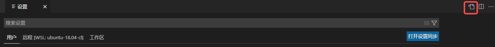

# 调试  
## **CMakeTools方式** （需要插件CMake，CMakeTools）  
原理：根据CMakeList.txt文件自动执行相关编译工作,它不会生成launch.json和task.json  
1，编写CMakeLists.txt文件  
2，按F1，输入cmake，查看关于cmaketools的快捷指令  
3，F7是cmake的build，ctrl+F5是cmake的debug  
(注意，确保在debug模式下(否则无法进入断点)，需要在CMakeList.txt上写上：set(CMAKE_BUILD_TYPE Debug)，另外如果这样还不能进入断点模式，考虑是否编译器选择不正确，切换其他的试一下)  

## **launch.json方式**  
原理：launch.json和task.json 本质是执行终端指令  
**先launch.json,后task.json**  
1，在main.cc, 点击“运行和调试”，点击“创建launch.json文件”，选择C++（GDB/LLDB），即可生成“launch.json”, 点击右下角“添加配置...”,选择相应的配置模板  
2，点击：菜单栏->终端->配置任务/配置默认生成任务，可以生成task.json  
**先task.json,后launch.json**  
1，在main.cc, 按F5，选择C++（GDB/LLDB）,选择C++/g++，即可生成task.json  
2，在main.cc, 点击“运行和调试”，点击“创建launch.json文件”，选择C++（GDB/LLDB），即可生成“launch.json”, 点击右下角“添加配置...”,选择相应的配置模板  
（注意：launch.json默认模板是没有“preLaunchTask”，此外，由于本质是执行CMekeList.txt,因此有关断点问题同上）

## 注意事项
有时候某个按键不生效（比如：F5），多数是该快捷键对应的插件出现问题问题（对应：C++插件出问题，），重新加载一下，并启用
记住，插件本质上只是一些配置文件，还需要我们安装相应的软件程序，供它查找/调用。  
例子1："Unable to find GDB in default search path and gdb." 可能是根本没有装上gdb,按照它的默认位置找不到gdb；  
例子2："Cpplint: Could not find cpplint executable" ，同样根本原因是没有装cpplint；  
例子3："The 'clang-format' command is not available. Please check your clang-format.executable user setting and ensure it is installed."，没有安装clang-format； 

如果debug调试模式下，不能正常打断点调试：  
情况1：CMakeList.txt没有相应的调试选项。比如：缺少 set(CMAKE_BUILD_TYPE Debug) 的配置项  
情况2：相应的源文件没有执行权限。比如：yy.cpp 的权限为-rx-rx-rx-，没有执行权限  
情况3：调试时的用户不正确。比如：yy.cpp 由 xxx 用户创建，但是在root用户下进行调试，root用户没有该文件的执行权限


## 文件误删除下的处理办法  
由于不小心rm -rf * 此时可以建立一个同名的文件夹以及相应的同名文件，vscode的时间线可以找回原来的保存备份

## 打不了断点的原因  
1，CMakeList.txt 没有设置 set(CMAKE_BUILD_TYPE Debug)  
2，编译时用户权限不匹配

## clangd与clang-format格式化冲突不起效
右键"格式化文档"，它会让你选择一种默认的格式化配置。
.jpg "clangd_and_clang-format.json") 
.jpg "clangd_and_clang-format.json")  
对应的则是setting.json文件中的
```json
{
    "[cpp]": {
        "editor.defaultFormatter": "xaver.clang-format"
    }
}
```

## VsCode的配置文件位置
"Ctrl + Shift + p" => "首选项：打开用户设置" ,点击右上角的红色方框 
 